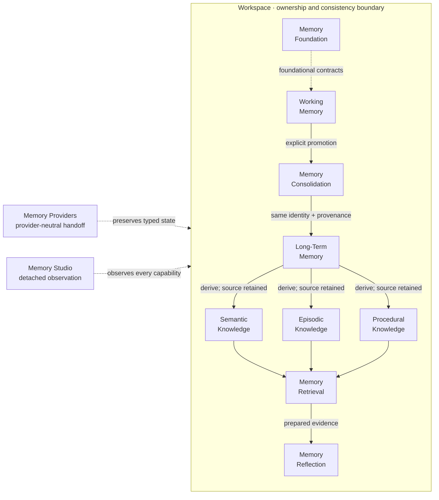
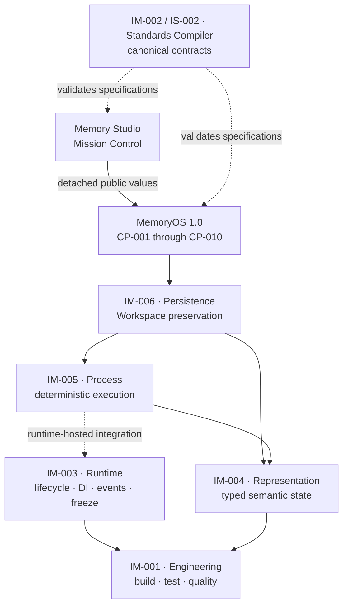

<!-- markdownlint-disable MD033 MD041 -->

<div align="center">
  
  <h1>MemoryOS 1.0</h1>
  <p><strong>The operating system for deterministic cognitive memory.</strong></p>
  <p>
    Working memory &rarr; durable evidence &rarr; semantic, episodic, and procedural knowledge<br />
    &rarr; explainable retrieval &rarr; source-preserving reflection.
  </p>
  <p>
    <a href="https://github.com/moelsaka01/cca-workspace/actions/workflows/ci.yml"></a>
    
    
    
    
    <a href="LICENSE"></a>
  </p>
  <p>
    <a href="#meet-memoryos-10">Product</a> ·
    <a href="#mission-control">Mission Control</a> ·
    <a href="#memoryos-architecture">Architecture</a> ·
    <a href="#run-memoryos">Run MemoryOS</a> ·
    <a href="#the-cca-foundation">CCA foundation</a>
  </p>
</div>

<p align="center">
  
</p>

<p align="center"><sub><strong>MemoryOS Mission Control</strong> — one Workspace, one cognitive topology, every released memory capability.</sub></p>

---

## Meet MemoryOS 1.0

MemoryOS is a released C++23 cognitive memory system built around explicit
state, stable identity, deterministic ordering, and complete evidence
provenance. It moves task-oriented information into durable Long-Term Memory,
derives semantic, episodic, and procedural knowledge without mutating the
evidence, retrieves across those knowledge forms, and produces traceable
reflections.

Every Asset remains inside one Workspace ownership boundary. Mission Control
makes that complete lifecycle observable as a single graph-native product
experience.

> [!NOTE]
> MemoryOS is not an LLM wrapper, a vector database, or a chat-history store. It is the inspectable memory substrate an intelligent system can build on: typed contracts, governed lifecycles, deterministic outcomes, atomic failure behavior, and explanation chains back to source evidence.

| Provenance first | Deterministic by contract | Workspace isolated | Runtime independent |
| :--- | :--- | :--- | :--- |
| Derived knowledge retains explicit source references. | Equivalent inputs and operation histories produce equivalent observable results. | Identity and ownership never drift across Workspace boundaries. | Runtime can host Services, but never owns memory state. |

## Mission Control

Memory Studio is the public face of MemoryOS: a passive, graph-native observability surface over detached MemoryOS state. The cognitive topology is the interface—not a chart placed inside a dashboard. Each perspective reveals the same system through a different lifecycle lens while preserving exact identities, ordering, provenance, and explanation-chain boundaries.

### Reflection

<p align="center">
  
</p>

<p align="center"><sub><strong>Reflection</strong> — prepared evidence converges into new knowledge without changing its sources.</sub></p>

<details>
  <summary><strong>Animated walkthroughs — capture slots</strong></summary>

  The following GIF locations are reserved for release captures. They are intentionally listed without broken image embeds until the final binaries are committed.

  | Planned GIF | Demonstrates |
  | :--- | :--- |
  | `docs/media/memoryos-mission-control.gif` | Topology navigation, layer focus, and graph inspection |
  | `docs/media/memoryos-retrieval-flow.gif` | Retrieval propagation from categorized knowledge to ranked candidates |
  | `docs/media/memoryos-reflection-convergence.gif` | Evidence paths converging into a source-preserving Reflection |
  | `docs/media/memoryos-provenance-trace.gif` | A complete explanation chain back to Long-Term Memory evidence |

</details>

## Why MemoryOS

Most memory products start with storage and add semantics later. MemoryOS starts with the guarantees that make memory dependable.

- **Evidence survives interpretation.** Semantic Concepts, Episodes, Procedures, Retrieval candidates, and Reflections preserve traceable links to their authoritative evidence.
- **Derived knowledge has its own identity.** Categorization creates new knowledge; it never reclassifies, transfers, or destroys a Long-Term Memory source.
- **Ordering is observable behavior.** Insertion order, chronology, stable ranking, ties, relationships, procedure steps, and explanation chains are deterministic.
- **Failure is atomic.** Public mutating operations are designed around strong exception guarantees and allocation-failure verification.
- **Ownership is explicit.** Assets belong to exactly one Workspace. Stateless Services perform behavior without becoming state owners.
- **Infrastructure cannot redefine meaning.** Provider-neutral handoff and Persistence preserve public semantics without introducing filesystem, database, cloud, or Runtime ownership.
- **The UI cannot smuggle in behavior.** Studio deep-copies released public values and observes them without polling, discovering, retrieving, mutating, or persisting memory.
- **The implementation follows frozen contracts.** Every capability ships with public-behavior tests, architecture-boundary checks, allocation-failure campaigns, examples, documentation, and conformance evidence.

## MemoryOS 1.0 capabilities

MemoryOS 1.0 delivers eleven bounded capabilities across the complete memory lifecycle.

**11 capabilities** · **414 mandatory requirements** · **3 operating systems in CI** · **1 explicit Workspace ownership model**

| Capability | What it does | Core guarantee |
| :--- | :--- | :--- |
| [Memory Foundation](repositories/cca-core/docs/memory-foundation.md) | Ordered `store`, `retrieve`, literal `search`, and `forget` | Replacement preserves insertion position |
| [Working Memory](repositories/cca-core/docs/working-memory.md) | Explicit task activation, temporary entries, logical expiration | Task state is Workspace-owned, never Runtime-owned |
| [Memory Consolidation](repositories/cca-core/docs/memory-consolidation.md) | Explicitly promotes Working Memory into Long-Term Memory | Same logical identity, complete provenance, atomic publication |
| [Long-Term Memory](repositories/cca-core/docs/long-term-memory.md) | Retains, searches, archives, restores, and forgets durable memory | Durable identity and deterministic retained order |
| [Semantic Memory](repositories/cca-core/docs/semantic-memory.md) | Derives concepts, categories, and concept relationships | Sources remain unchanged and explicitly referenced |
| [Episodic Memory](repositories/cca-core/docs/episodic-memory.md) | Derives occurrence-oriented experiences and event relationships | Logical chronology and evidence provenance are preserved |
| [Procedural Memory](repositories/cca-core/docs/procedural-memory.md) | Derives reusable activity knowledge with ordered steps | Procedure identity, step order, and evidence remain stable |
| [Memory Retrieval](repositories/cca-core/docs/memory-retrieval.md) | Searches, filters, and ranks across all three knowledge forms | Stable ranking and mechanical explanation chains |
| [Memory Reflection](repositories/cca-core/docs/memory-reflection.md) | Derives caller-supplied new knowledge from prepared retrieved evidence | Every contributing candidate and explanation chain survives |
| [Memory Providers](repositories/cca-core/docs/memory-providers.md) | Imports and exports detached typed MemoryOS state | Provider replacement cannot change MemoryOS semantics |
| [Memory Studio](repositories/cca-studio/docs/memory-studio.md) | Observes, inspects, traces, summarizes, exports, and forgets Studio sessions | Passive deep-copy observation with no memory mutation |

## MemoryOS architecture

Workspace is the sole ownership and consistency boundary. Long-Term Memory is the authoritative retained evidence layer. Semantic, Episodic, and Procedural Memory derive independently identified knowledge while leaving their Long-Term sources unchanged.



Three rules define the model:

1. **Evolution is explicit.** Working-to-Long-Term promotion happens only through Consolidation; retrieval changes accessibility, not ownership.
2. **Derivation is non-destructive.** Semantic Concepts, Episodes, Procedures, and Reflections have their own identities and preserve source references.
3. **Observation is passive.** Providers transport detached state, Persistence preserves Workspace state, Runtime hosts stateless Services, and Studio observes without taking ownership.

For implementation details, start with the
[Memory Foundation](repositories/cca-core/docs/memory-foundation.md) and
[Memory Studio conformance evidence](repositories/cca-studio/docs/memory-studio-conformance-evidence.md).
The CCA foundations beneath this product are introduced later in this README.

## Run MemoryOS

### Open Mission Control

Memory Studio has no npm dependencies. With Git and Node.js 20 or newer:

```bash
git clone https://github.com/moelsaka01/cca-workspace.git
cd cca-workspace
node repositories/cca-studio/scripts/serve.mjs
```

Open [http://127.0.0.1:4173/](http://127.0.0.1:4173/). The built-in detached
observation is deterministic and requires no backend.

### Prerequisites

| Tool | Requirement |
| :--- | :--- |
| C++ compiler | C++23 capable |
| CMake | 3.28 or newer |
| Ninja | Available on `PATH` |
| Git | Required by the pinned vcpkg bootstrap |
| Python | 3.12 or newer |
| Node.js | 20 or newer, only for Memory Studio |

The first bootstrap requires network access to acquire the repository-pinned vcpkg checkout. vcpkg supplies GoogleTest and yaml-cpp. Memory Studio itself has no npm dependencies.

### Clone and build from source

Source bootstrap is the supported installation path for the complete workspace.

```bash
git clone https://github.com/moelsaka01/cca-workspace.git
cd cca-workspace
bash scripts/bootstrap.sh
cmake --build --preset default
ctest --preset default
```

On Windows PowerShell:

```powershell
git clone https://github.com/moelsaka01/cca-workspace.git
Set-Location cca-workspace
pwsh -File scripts/bootstrap.ps1
cmake --build --preset default
ctest --preset default
```

The bootstrap scripts configure the `default` preset. To reconfigure explicitly, run `cmake --preset default` before the build.

### Studio integration

A host can inject a detached Studio projection through the documented adapter
without changing the frozen C++ Contract. See the
[Studio README](repositories/cca-studio/README.md) for the integration
boundary.

You can also use the package script:

```bash
cd repositories/cca-studio
npm start
```

### Run the C++ examples

After a default build on a POSIX host:

```bash
# Memory Foundation
./out/build/default/repositories/cca-core/cca_memory_example

# Retrieval and source-preserving Reflection
./out/build/default/repositories/cca-core/cca_memory_reflection_example

# Headless Memory Studio contract
./out/build/default/repositories/cca-studio/cca_memory_studio_example

# Disposable Runtime host
./out/build/default/repositories/cca-core/cca-runtime
```

On Windows, use the corresponding `.exe` files. More focused examples are indexed in [examples/README.md](examples/README.md) and under [`repositories/cca-core/examples`](repositories/cca-core/examples).

## Verification

The `ci` preset enables warnings as errors. The GitHub Actions workflow builds and tests on Ubuntu, macOS, and Windows, then runs formatting, static analysis, AddressSanitizer/UndefinedBehaviorSanitizer, coverage, and an install smoke test.

```bash
cmake --preset ci
cmake --build --preset ci
ctest --preset ci
```

Run only the MemoryOS or Studio CTest labels:

```bash
ctest --preset ci -L memory
ctest --preset ci -L studio
```

Run the dependency-free Studio web tests directly:

```bash
npm --prefix repositories/cca-studio test
```

Additional presets are available for `release`, `analysis`, `coverage`, `sanitizer`, and dependency-free structural `minimal` builds. See [developer setup](docs/developer-setup.md) and [build instructions](docs/build-instructions.md).

## The CCA foundation

MemoryOS is the released product experience. The
**Cognitive Computing Architecture (CCA)** is the broader governed ecosystem
that makes its guarantees possible.

CCA supplies the engineering discipline, canonical specifications, Runtime,
Representation, Process, and Persistence foundations beneath MemoryOS. Those
milestones are not legacy side projects; they are the deliberate foundation
on which the product is built.

### Foundational milestones

| Milestone | Foundation | What it established for MemoryOS |
| :--- | :--- | :--- |
| **IM-001** | Engineering Foundation | C++23 workspace structure, reproducible CMake and vcpkg builds, shared facilities, testing infrastructure, and quality gates |
| **IM-002 / IS-002** | Canonical Specification and Standards Compiler | Schema-governed contracts, deterministic validation, diagnostics, reports, and a specification-first delivery model |
| **IM-003** | [Runtime Foundation](repositories/cca-core/docs/runtime-programming-model.md) | Explicit lifecycle, typed Services, dependency injection, deterministic startup and shutdown, Runtime Freeze, events, and observability |
| **IM-004** | [Representation Foundation](repositories/cca-core/docs/representation-foundation.md) | Typed semantic state, stable identity, validation, transactions, snapshots, and immutable frozen documents |
| **IM-005** | [Process Foundation](repositories/cca-core/docs/process-foundation.md) | Deterministic execution of Representation documents with explicit state, context, results, and failure behavior |
| **IM-006** | [Persistence Foundation](repositories/cca-core/docs/persistence-foundation.md) | Provider-independent preservation and restoration of durable Workspace state while Runtime remains ephemeral |

The repository roadmap records the implemented compiler slice as IS-002; it
is the IM-002-era compiler milestone in the foundational sequence. Together,
IM-001 through IM-006 establish the platform beneath the CP-001 through CP-011
MemoryOS product capabilities.

### Ecosystem position

The production dependency direction is acyclic and points toward lower-level
foundations.



The Standards Compiler is an architecture-neutral toolchain. It validates
canonical specifications and produces deterministic reports and artifacts; it
does not execute MemoryOS behavior. Runtime can host stateless Services but
never owns MemoryOS state. Persistence preserves durable Workspace state and
excludes Runtime implementation state.

The early foundation boundaries remain recorded in
[ARCHITECTURE.md](ARCHITECTURE.md) and [ROADMAP.md](ROADMAP.md). Those
documents preserve their milestone-era scope; this README presents the current
MemoryOS 1.0 product landing experience.

## Project structure

```text
cca-workspace/
├── repositories/
│   ├── cca-core/                 # Runtime, Representation, Process,
│   │   │                         # Persistence, and CP-001…CP-010
│   │   ├── include/cca/memory/   # Released MemoryOS public APIs
│   │   ├── src/memory/           # MemoryOS implementations
│   │   ├── tests/                # Unit, boundary, and failure campaigns
│   │   ├── examples/             # Executable capability examples
│   │   └── docs/                 # API guides and conformance evidence
│   ├── cca-studio/               # CP-011 C++ contract + graph-native web UI
│   │   ├── include/              # Frozen public Studio API
│   │   ├── src/                  # Headless observation implementation
│   │   ├── web/                  # Dependency-free Mission Control
│   │   ├── tests/                # C++ and web verification
│   │   └── docs/screenshots/     # Product captures used by this README
│   ├── cca-compiler/             # Canonical Specification compiler + CLI
│   ├── memoryos/                 # Reserved repository boundary
│   ├── cca-sdk/                  # Reserved repository boundary
│   ├── cca-conformance/          # Reserved repository boundary
│   └── cca-atlas/                # Reserved repository boundary
├── specification/                # Canonical format and JSON Schema
├── examples/                     # Workspace-level examples and fixtures
├── docs/                         # Engineering and compiler documentation
├── scripts/                      # Bootstrap, build, analysis, and coverage
├── tests/                        # Workspace integration verification
├── tools/                        # Repository engineering utilities
├── ARCHITECTURE.md               # Workspace foundation architecture
├── ROADMAP.md                    # Historical foundation roadmap and change rules
└── CMakePresets.json             # Reproducible build profiles
```

> [!TIP]
> The released MemoryOS implementation lives in `repositories/cca-core`. The top-level `repositories/memoryos` directory is an intentionally reserved boundary and does not contain the current implementation.

## Documentation

| Area | Start here |
| :--- | :--- |
| MemoryOS capabilities | [Memory Foundation](repositories/cca-core/docs/memory-foundation.md) · [Working](repositories/cca-core/docs/working-memory.md) · [Long-Term](repositories/cca-core/docs/long-term-memory.md) · [Semantic](repositories/cca-core/docs/semantic-memory.md) · [Episodic](repositories/cca-core/docs/episodic-memory.md) · [Procedural](repositories/cca-core/docs/procedural-memory.md) |
| Knowledge lifecycle | [Consolidation](repositories/cca-core/docs/memory-consolidation.md) · [Retrieval](repositories/cca-core/docs/memory-retrieval.md) · [Reflection](repositories/cca-core/docs/memory-reflection.md) · [Providers](repositories/cca-core/docs/memory-providers.md) |
| Mission Control | [Memory Studio API and behavior](repositories/cca-studio/docs/memory-studio.md) · [Conformance evidence](repositories/cca-studio/docs/memory-studio-conformance-evidence.md) |
| Product presentation | [GitHub screenshot specification](repositories/cca-studio/docs/github-screenshot-specification.md) · [MemoryOS 1.0 launch demo package](repositories/cca-studio/docs/memoryos-1.0-launch-demo-production-package.md) |
| CCA foundations | [Runtime](repositories/cca-core/docs/runtime-programming-model.md) · [Representation](repositories/cca-core/docs/representation-foundation.md) · [Process](repositories/cca-core/docs/process-foundation.md) · [Persistence](repositories/cca-core/docs/persistence-foundation.md) |
| Standards Compiler | [Canonical format](specification/canonical-format.md) · [Pipeline](docs/pipeline.md) · [CLI](docs/cli.md) · [Generators](docs/generators.md) |
| Engineering | [Developer setup](docs/developer-setup.md) · [Build instructions](docs/build-instructions.md) · [Coding standards](docs/coding-standards.md) |

## Roadmap

| Release horizon | Theme | Status |
| :--- | :--- | :--- |
| **MemoryOS 1.0** | Deterministic memory lifecycle, provenance, retrieval, reflection, provider-neutral handoff, and Mission Control | **Released** |
| **MemoryOS 1.1** | Living Connectome | **Planned** |
| **Future** | Personalization, shared memory, and scale | Product exploration |

### MemoryOS 1.1 — Living Connectome

Living Connectome is the planned product-experience direction for the next MemoryOS release. Its purpose is to make the cognitive topology feel continuous, temporal, and explainable while retaining the deterministic 1.0 foundation.

- Make one evolving topology the primary navigation model across the memory lifecycle.
- Show provenance as visible evidence currents rather than detached metadata.
- Animate retrieval propagation from Semantic, Episodic, and Procedural sources.
- Make Reflection convergence the signature MemoryOS interaction.
- Add temporal playback and comparison for changes in the observed connectome.
- Preserve clarity at scale through semantic focus, density control, responsive composition, and accessible motion.
- Keep every visual claim traceable to the passive Studio observation contract.

The 1.1 scope is roadmap direction, not a new public API or architectural authorization. Contract changes follow the project’s architecture → specification → review → freeze → implementation → verification → release lifecycle.

Longer-term product themes remain:

1. **Personalization** — preferences, relevance controls, and transparent suggestions.
2. **Shared memory** — team collections, review workflows, and controlled sharing.
3. **Scale** — migration tooling, administration, analytics, and broader integrations.

See [ROADMAP.md](ROADMAP.md) for the historical foundation milestones and
governed change rules.

## Contributing

External contribution intake is currently paused while the project owner resolves the software license and inbound contribution terms. Please do not assume that a pull request grants or receives licensing rights.

Authorized contributors should:

1. Read [CONTRIBUTING.md](CONTRIBUTING.md), [CODE_OF_CONDUCT.md](CODE_OF_CONDUCT.md), and [ARCHITECTURE.md](ARCHITECTURE.md).
2. Preserve frozen public contracts, Workspace ownership, deterministic behavior, and dependency direction.
3. Add automated evidence for every changed public behavior.
4. Run the `ci` preset and the relevant architecture-boundary and allocation-failure tests.
5. Keep implementation, specification, and product-experience changes in their governed boundaries.

Contribution intake can open after the project records an approved license, inbound terms, and community governance channel.

## License

No software license has been selected for this repository. [LICENSE](LICENSE) is a pending-decision notice—not an open-source license grant—and currently grants no permission to use, copy, modify, merge, publish, distribute, sublicense, or sell the contents beyond rights supplied independently by applicable law.

## Acknowledgements

MemoryOS stands on disciplined systems engineering and a small, dependable toolchain. The project acknowledges the maintainers and communities behind CMake, Ninja, vcpkg, GoogleTest, yaml-cpp, modern C++, and GitHub Actions, together with every reviewer who helped turn architectural intent into testable contracts.

The product experience also reflects a simple principle: complex cognition should become more understandable as it grows—not less.

---

<div align="center">
  <strong>MemoryOS 1.0</strong><br />
  Deterministic memory. Preserved evidence. Explainable evolution.
</div>
