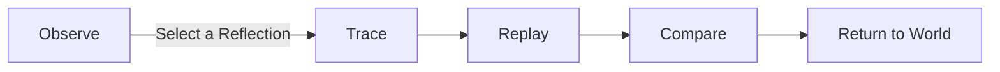
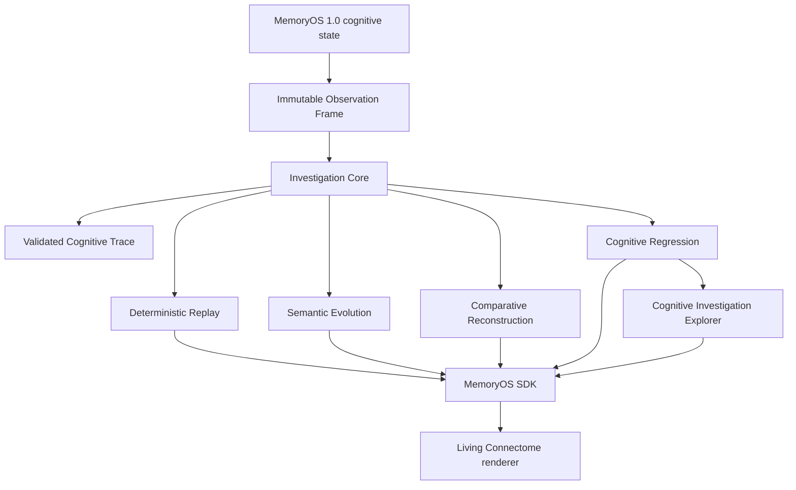

<!-- markdownlint-disable MD033 MD041 -->

<div align="center">
  
  <h1>MemoryOS</h1>
  <p><strong>Deterministic memory infrastructure with a cognitive investigation environment engineers can inspect step by step.</strong></p>
</div>

<p align="center">
  
</p>

<p align="center">
  <a href="https://github.com/moelsaka01/cca-workspace/actions/workflows/ci.yml"></a>
  
  
  
  
  <a href="LICENSE"></a>
</p>

<p align="center">
  <a href="#overview">Overview</a> ·
  <a href="#core-workflow">Workflow</a> ·
  <a href="#memoryos-11-highlights">Highlights</a> ·
  <a href="#architecture">Architecture</a> ·
  <a href="#getting-started">Getting started</a> ·
  <a href="#roadmap">Roadmap</a>
</p>

## Overview

MemoryOS is a deterministic cognitive investigation environment built on a
complete, Workspace-owned memory lifecycle. It moves task context into durable
Long-Term Memory, derives semantic, episodic, and procedural knowledge without
mutating the evidence, retrieves across those knowledge forms, and preserves
complete provenance through Reflection.

MemoryOS v1.1 makes that system observable. Engineers can:

- **Observe** an immutable cognitive state.
- **Trace** a Reflection back to its originating evidence.
- **Replay** the exact semantic steps that produced it.
- **Compare** two observations without comparing layouts or pixels.
- **Understand** where cognition remained stable and where it diverged.

Determinism is the difference between a visualization and an engineering tool.
Given the same inputs and operation history, MemoryOS preserves the same
identity, ordering, ownership, trace, replay, and comparison results. The
renderer presents those results; it never invents them.

> [!NOTE]
> MemoryOS is not an LLM wrapper, a vector database, or a chat-history store. It is an inspectable memory substrate and investigation system with explicit ownership, non-destructive derivation, atomic failure behavior, and evidence-preserving explanations.

## Core Workflow



| Step | What the engineer sees |
| :--- | :--- |
| **Observe** | One stable semantic world built from an accepted immutable Observation Frame. |
| **Trace** | The validated path from source evidence through semantic transformations and retrieval to a Reflection. |
| **Replay** | Deterministic reconstruction of that path, one real trace element at a time. |
| **Compare** | Semantic change between observations, followed by synchronized reconstruction of two traces when available. |
| **Return** | The complete observed world, unchanged by the investigation. |

Selecting a valid **Reflection** begins an investigation. Replay becomes
available from its Trace; Compare becomes available after Replay completes and
at least two observations exist.

## MemoryOS 1.1 Highlights

- **Stable Semantic World.** Immutable Observation Frames map to deterministic cognitive geography. Regions do not drift between observations, so engineers can build spatial memory and identify local change without losing orientation.

- **Cognitive Trace.** Each trace is an immutable, validated, renderer-independent journey from evidence to the currently observed Reflection. Missing evidence and inconsistent relationships fail validation instead of being inferred.

- **Living Connectome.** The graph is the investigation surface. Stable cognitive regions provide context while an active Trace becomes the dominant visual story; unrelated topology remains visible but deliberately quiet.

- **Cognitive Replay.** Replay reconstructs an existing Trace in deterministic order. Every completed, current, and future step corresponds to a real trace element—there are no synthetic events or simulated cognition.

- **Cognitive Evolution.** Evolution compares the semantic contents of two Observation Frames and reports only added, removed, or modified cognition. Layout, rendering, and pixels are never comparison inputs.

- **Comparative Reconstruction.** Two validated traces advance together in one semantic world. Shared cognition remains unified, while the exact semantic divergence becomes the focus of the investigation.

## Architecture

MemoryOS separates cognitive truth from presentation. MemoryOS 1.0 cognitive
state is supplied through a detached Studio snapshot; Runtime implementation
state is explicitly excluded. Immutable investigation models are computed
before the renderer receives them.



The boundary is intentional:

1. Memory Assets remain owned by exactly one Workspace.
2. Long-Term Memory remains the authoritative evidence layer.
3. Derived knowledge keeps its own identity and explicit source references.
4. Observation never transfers ownership or mutates cognitive state.
5. Trace, Replay, Evolution, Comparative Reconstruction, Cognitive Regression, and evidence navigation are deterministic engines—not renderer behavior.

MemoryOS is the product layer in the broader Cognitive Computing Architecture
workspace. IM-001 through IM-006 provide its engineering, compiler, Runtime,
Representation, Process, and Persistence foundations. See
[ARCHITECTURE.md](ARCHITECTURE.md) for the governed boundaries and dependency
direction, and the [Studio documentation](repositories/cca-studio/docs/README.md)
for the investigation architecture.

MemoryOS 1.2 exposes the frozen Investigation Core through a thin, versioned
[SDK facade](repositories/cca-sdk/README.md). Studio imports that facade rather
than the Core. Python and C++ retain one private Core binding per SDK instance;
the binding transports explicit commands and immutable results but implements
no investigation behavior. The official
[MemoryOS CLI](repositories/memoryos-cli/README.md) is an independent SDK
consumer for deterministic shell, CI, and JSON Lines automation. MO-1206 adds
read-only Cognitive Regression Analysis to the same Core and exposes its exact
reports through every SDK language and the CLI. MO-1207 adds the Cognitive
Investigation Explorer, which follows canonical pointers already present in
those reports without replay or inference.

MO-1208 publishes **CCA-MEMORYOS-1.0**, the implementation-independent
MemoryOS Standard, and activates the official
[MemoryOS Conformance Suite](repositories/cca-conformance/README.md).
MemoryOS 1.2.0 is the initial Reference Implementation of that Standard; the
implementation is conformance evidence, not a normative definition of
MemoryOS behavior. The authoritative publication is maintained separately at
`cca-specifications/specifications/CCA-MEMORYOS-1.0/`.

## Getting Started

### 1. Run Mission Control

Memory Studio has no npm dependencies. With Git and Node.js 20 or newer:

```bash
git clone https://github.com/moelsaka01/cca-workspace.git
cd cca-workspace
node repositories/cca-studio/scripts/serve.mjs
```

Open [http://127.0.0.1:4173/](http://127.0.0.1:4173/). The included detached
observation is deterministic and requires no backend.

### 2. Build and verify the complete workspace

The full C++ workspace requires a C++23 compiler, CMake 3.28 or newer, Ninja,
Git, and Python 3.12 or newer. The first bootstrap uses the repository-pinned
vcpkg checkout.

```bash
bash scripts/bootstrap.sh
cmake --build --preset default
ctest --preset default
```

<details>
  <summary><strong>Windows PowerShell</strong></summary>

```powershell
pwsh -File scripts/bootstrap.ps1
cmake --build --preset default
ctest --preset default
```

</details>

For the warnings-as-errors verification profile:

```bash
cmake --preset ci
cmake --build --preset ci
ctest --preset ci
npm --prefix repositories/cca-studio test
npm --prefix repositories/cca-conformance test
```

See [developer setup](docs/developer-setup.md) and
[build instructions](docs/build-instructions.md) for all supported presets and
tooling.

### 3. Investigate cognition

1. Start in **Observe** and inspect the stable semantic world.
2. Select a valid **Reflection** to enter Trace.
3. Choose **Reconstruct** to begin Replay; use Play, Pause, Previous, Next, or Restart.
4. Accept another observation and complete Replay to enable **Compare**.
5. Use **Compare traces** for synchronized Comparative Reconstruction.
6. Choose **Return to World** to leave the investigation without changing cognition.

### 4. Automate through the SDK-backed CLI

The workspace executable requires Node.js 20 or newer and no external npm
packages:

```bash
node repositories/memoryos-cli/bin/memoryos.js help
node repositories/memoryos-cli/bin/memoryos.js verify investigation.mip --json
node repositories/memoryos-cli/bin/memoryos.js regression baseline.mip candidate.mip --json
node repositories/memoryos-cli/bin/memoryos.js investigate regression.json --reflection reflection-17
```

Optionally link the `memoryos` command to this checkout with
`cd repositories/memoryos-cli && npm link`. Replay and comparison require
explicit package Trace selectors. Regression accepts two verified MIPs and
reports only Core-observed differences; the CLI never infers cognition.

## Repository Structure

| Path | Purpose |
| :--- | :--- |
| [`repositories/cca-core`](repositories/cca-core) | MemoryOS capabilities plus the Runtime, Representation, Process, and Persistence foundations. |
| [`repositories/cca-studio`](repositories/cca-studio) | The frozen Memory Studio contract, Mission Control UI, single Investigation Core—including Cognitive Regression and the MO-1207 Explorer—canonical MIP implementation, dependency-free AI runtime adapters, tests, media, and documentation. |
| [`repositories/cca-sdk`](repositories/cca-sdk) | The JavaScript, Python, and native C++ SDK facades, private Core binding, regression and evidence-navigation APIs, examples, tests, and conformance evidence. |
| [`repositories/memoryos-cli`](repositories/memoryos-cli) | The standalone, scriptable SDK client, including deterministic regression analysis, evidence navigation, and JSON automation. |
| [`repositories/cca-conformance`](repositories/cca-conformance) | The official deterministic CCA-MEMORYOS-1.0 conformance suite, pinned requirement manifest, schemas, reports, and Reference Implementation guidance. |
| [`docs`](docs) | Workspace engineering, compiler, build, and contributor documentation. |
| [`specification`](specification) | Canonical specification format and schema used by the CCA Standards Compiler. |

The implementation is intentionally split across `cca-core` and `cca-studio`.
`repositories/memoryos` is a reserved boundary, not a second MemoryOS
implementation.

## Release History

| Release | Summary |
| :--- | :--- |
| **MemoryOS 1.0** | Established the deterministic memory lifecycle: Working Memory, Consolidation, Long-Term Memory, semantic, episodic, and procedural derivation, Retrieval, Reflection, Providers, and the frozen Studio contract. |
| **MemoryOS 1.1 · v1.1.0** | Added observable cognition without changing the MemoryOS 1.0 runtime or public memory contracts. MO-1101 through MO-1108 delivered the Stable Semantic World, Cognitive Trace, Living Connectome, Cognitive Replay, Cognitive Polish, Cognitive Evolution, Comparative Reconstruction, and the unified production workflow. |
| **MemoryOS 1.2 · in development** | Adds the canonical Memory Investigation Package (MO-1201), dependency-free adapters (MO-1202), one renderer-independent Investigation Core (MO-1203), public SDK facades (MO-1204), the SDK-only automation CLI (MO-1205), deterministic Cognitive Regression Analysis (MO-1206), direct regression-evidence navigation (MO-1207), and the implementation-independent MemoryOS Standard with its official conformance suite (MO-1208). |

See [CHANGELOG.md](CHANGELOG.md) for milestone-level engineering records and
[RELEASE_NOTES.md](RELEASE_NOTES.md) for compatibility and verification details.

## Known Limitations

The current product-facing limitation is first-time **Observe → Trace**
discoverability: Trace begins only after the engineer selects a valid
Reflection. This does not affect Runtime behavior, determinism, Trace
correctness, Replay, Evolution, Comparative Reconstruction, public APIs, or
architecture.

See [KNOWN_ISSUES.md](KNOWN_ISSUES.md) for the documented workaround and
repository publication notes.

## Roadmap

MemoryOS 1.2 begins with portable deterministic investigations: MIP-001 defines
the canonical package, MO-1201 implements it, MO-1202 adds provider-neutral
[AI runtime adapters](repositories/cca-studio/docs/ai-runtime-adapters.md), and
MO-1203 establishes the single [Investigation Core](repositories/cca-studio/docs/investigation-core.md)
used by all clients. MO-1204 adds the public
[MemoryOS SDK](repositories/cca-sdk/README.md), migrates Studio to its
JavaScript facade, and gives Python and C++ the same deterministic Core
behavior through one private binding contract. MO-1205 adds the
[MemoryOS CLI](repositories/memoryos-cli/README.md) as the first independent
SDK consumer and keeps all automation downstream of the same execution
authority. MO-1206 adds [Cognitive Regression Analysis](repositories/cca-sdk/docs/regression-guide.md):
the Core compares two immutable investigations, while SDK and CLI consumers
transport the same deterministic report without explanation, scoring, or
inference.
MO-1207 adds the
[Cognitive Investigation Explorer](repositories/cca-studio/docs/cognitive-investigation-explorer.md),
so engineers can move from that report to exact canonical evidence pointers
through Studio, SDK, or `memoryos investigate` without rerunning Replay or
duplicating investigation behavior.
MO-1208 publishes CCA-MEMORYOS-1.0 and assesses MemoryOS 1.2.0 as its initial
Reference Implementation through the
[official conformance suite](repositories/cca-conformance/README.md). Standard,
product, package, Core, SDK, CLI, and suite versions remain independently
identified.
Investigation onboarding and Reflection discoverability remain planned product
refinements. None of this redesigns the MemoryOS 1.0 Runtime or the released
MemoryOS 1.1 investigation architecture.

See [ROADMAP.md](ROADMAP.md) for governed release themes and foundation history.

## Contributing

Read [CONTRIBUTING.md](CONTRIBUTING.md) and
[CODE_OF_CONDUCT.md](CODE_OF_CONDUCT.md) before proposing a change. Contributions
must preserve frozen public contracts, Workspace ownership, deterministic
behavior, and dependency direction.

External contribution intake remains paused until the project owner resolves
the software license and inbound contribution terms.

## License

No software license has been selected. [LICENSE](LICENSE) is a pending-decision
notice, not an open-source license grant. Review it before using, copying,
modifying, or distributing repository contents.

---

<div align="center">
  <strong>MemoryOS v1.1.0</strong><br />
  Observe. Trace. Replay. Compare. Understand.
</div>
