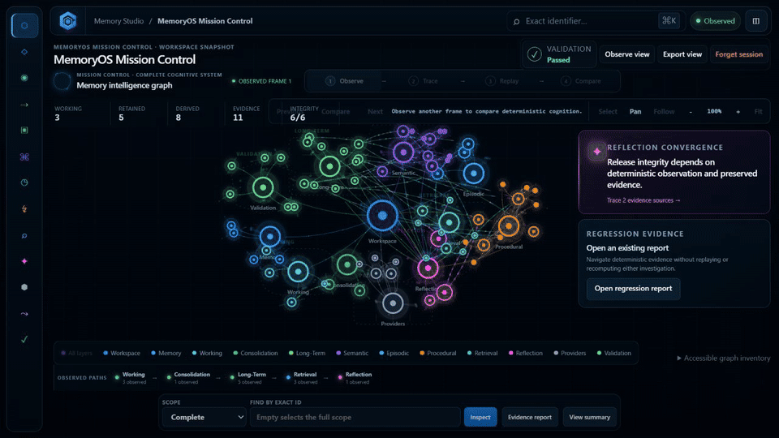
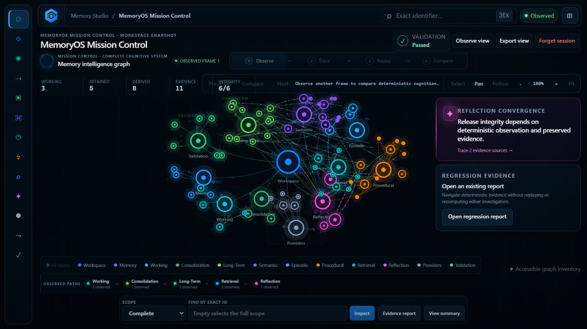
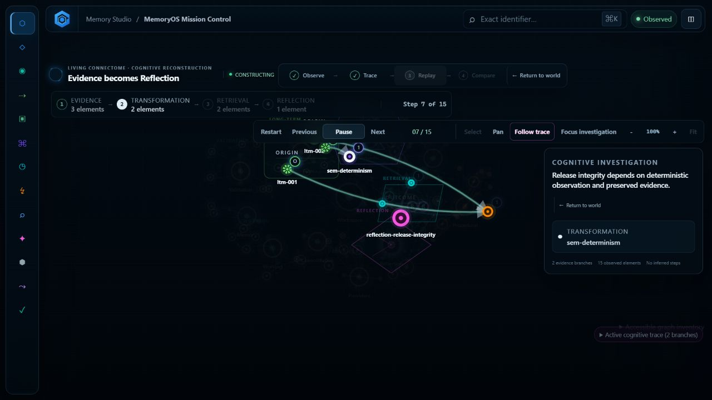
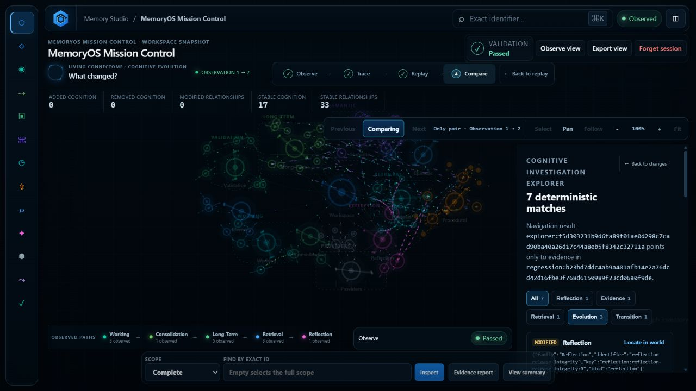

<!-- markdownlint-disable MD033 MD041 -->

  
  <h1>MemoryOS</h1>
  
<strong>The open standard and reference implementation for deterministic AI investigations.</strong>

  
Observe what happened. Trace the evidence. Replay every step. Compare what changed.

  
  
  
  
  
  
  

  <a href="#why-memoryos">Why MemoryOS</a> ·
  <a href="#platform">Platform</a> ·
  <a href="#investigation-workflow">Workflow</a> ·
  <a href="#architecture">Architecture</a> ·
  <a href="#getting-started">Getting started</a> ·
  <a href="#documentation">Documentation</a>

  

  <a href="repositories/cca-studio/docs/media/memoryos-v1.2-demo.mp4">Watch the full-quality MemoryOS v1.2 demonstration</a>

## Why MemoryOS

AI systems can produce an answer while hiding the exact evidence and
transformations that led to it. MemoryOS makes those investigation facts
portable, verifiable, and reproducible.

MemoryOS records deterministic cognition rather than generating an explanation
after the fact. Engineers can inspect origin evidence, semantic
transformations, retrievals, reflections, transitions, and verification state
without asking an AI model to interpret its own behavior.

MemoryOS is not an LLM wrapper, vector database, or monitoring dashboard. It is
an implementation-independent standard, a reference implementation, and a set
of developer tools for evidence-based AI investigation.

## Platform

| Layer | Responsibility |
|---|---|
| **MemoryOS Standard** | Defines the implementation-independent contract for deterministic AI investigations. |
| **Reference Implementation** | Implements the complete deterministic memory and investigation lifecycle. |
| **Memory Investigation Package (MIP)** | Carries canonical, integrity-verified investigation state between tools and runtimes. |
| **AI Runtime Adapters** | Translate settled OpenAI Agents SDK, Anthropic SDK, and LangGraph events without changing runtime truth. |
| **Investigation Core** | Owns observation, trace, replay, comparison, regression, and evidence navigation. |
| **Investigation Policy Engine** | Evaluates closed deterministic Policies over one authoritative point-in-time fact context. |
| **MemoryOS SDK** | Exposes the Core consistently to JavaScript, Python, and C++. |
| **MemoryOS CLI** | Brings the same SDK operations to terminals, scripts, and CI. |
| **Memory Studio** | Presents the Living Connectome and the complete investigation workflow. |
| **Conformance Suite** | Verifies compatibility with CCA-MEMORYOS-1.0 through deterministic evidence. |

One authority computes investigation state. Every interface consumes that same
state:

~~~mermaid
flowchart LR
    Runtime[AI Runtime] --> Adapter[Runtime Adapter]
    Adapter --> MIP[Memory Investigation Package]
    MIP --> Core[Investigation Core]
    Core --> SDK[MemoryOS SDK]
    SDK --> Studio[Memory Studio]
    SDK --> CLI[MemoryOS CLI]
    Standard[MemoryOS Standard] -. governs .-> MIP
    Standard -. governs .-> Core
    Standard -. governs .-> SDK
    Conformance[Conformance Suite] -. verifies .-> Core
~~~

## Investigation workflow

~~~mermaid
flowchart LR
    Observe --> Trace --> Replay --> Compare --> Investigate[Investigate evidence] --> Return[Return to world]
~~~

- **Observe** accepts a real Workspace observation and preserves its identity.
- **Trace** reconstructs the immutable path from evidence to Reflection.
- **Replay** reveals that path one semantic step at a time.
- **Compare** reports deterministic differences between two observations.
- **Investigate** navigates directly from a regression fact to its source
  evidence without recomputing the investigation.
- **Return** restores the stable semantic world and its spatial context.

Selecting a valid Reflection in Observe mode begins an investigation.

## Corrective v1.2.1 baseline

MemoryOS v1.2.1 is the corrected Reference Implementation baseline. The
v1.2.0 Git source archive omitted already-intended source, registered tests,
fixtures, examples, required documentation, and frozen Standard and MIP
publication assets. v1.2.1 restores only the reviewed v1.2 bytes and publishes
new conformance provenance bound to the repaired tracked tree.

The released CSP-safe Studio revisions remain authoritative. CCA-MEMORYOS-1.0,
CCA-MIP-1.0, Investigation Core, SDK, CLI, Cognitive Regression, Cognitive
Investigation Explorer, lifecycle, and Studio semantics are unchanged. The
v1.2.0 commit, tag, manifest, and evidence remain immutable historical records.

## MemoryOS 1.3 development

MO-1301 adds deterministic [Investigation Policies](docs/investigation-policies.md)
for engineering operations. A closed Policy or Policy Set evaluates facts
atomically projected by the Investigation Core, with optional trusted Cognitive
Regression facts. Exact evidence, Evaluation Identity, Resource Profile,
canonical outcome bytes, and stable PASS/FAIL/COULD_NOT_EVALUATE decisions are
shared through SDK and CLI 1.1 surfaces.

This work is unreleased. MemoryOS v1.2.1 remains the stable compatibility
baseline and CCA-MEMORYOS-1.0 remains the published Standard. MO-1302 GitHub
Actions integration and the candidate CCA-MEMORYOS-1.1 publication are separate
later gates.

## MemoryOS v1.2 highlights

### Portable investigation truth

The canonical [Memory Investigation Package](repositories/cca-studio/docs/memory-investigation-packages.md)
defines stable identifiers, canonical ordering, validation, checksums, and
compatibility rules. Exported investigations can be verified and imported
without carrying UI state, generated explanations, or provider-specific
semantics.

### Provider-independent observation

[AI Runtime Adapters](repositories/cca-studio/docs/ai-runtime-adapters.md)
translate completed OpenAI Agents SDK, Anthropic SDK, and LangGraph runs into
the same deterministic package contract. Adapters translate; they never infer
cognition.

### One Investigation Core

The renderer-independent [Investigation Core](repositories/cca-studio/docs/investigation-core.md)
is the sole authority for lifecycle transitions, Cognitive Trace, Replay,
Evolution, Comparative Reconstruction, Regression, and Explorer navigation.

### SDK and CLI

The [MemoryOS SDK](repositories/cca-sdk/README.md) provides JavaScript, Python,
and C++ access. The [MemoryOS CLI](repositories/memoryos-cli/README.md) exposes
the same behavior for local workflows and automation, with deterministic human
and JSON output.

### Cognitive Regression

[Cognitive Regression Analysis](repositories/cca-studio/docs/cognitive-regression.md)
compares two investigations and reports only observed differences in evidence,
retrieval, reflection, replay, evolution, verification, transitions, and
lifecycle state.

### Investigation Explorer

The [Cognitive Investigation Explorer](repositories/cca-studio/docs/cognitive-investigation-explorer.md)
moves from a regression result to the exact deterministic evidence that caused
it. It performs no replay, inference, ranking, or generated explanation.

### Open standard and conformance

[CCA-MEMORYOS-1.0](https://github.com/moelsaka01/memoryos-specification)
defines the open MemoryOS Standard. The
[official Conformance Suite](repositories/cca-conformance/README.md) binds its
normative requirements to reproducible evidence and Reference Implementation
assessment.

## Architecture

MemoryOS separates cognition, investigation, programmability, automation, and
presentation:

~~~mermaid
flowchart TB
    Runtime[MemoryOS Runtime owns cognition]
    Observation[Immutable Observation]
    Core[Investigation Core owns investigation execution]
    Trace[Cognitive Trace]
    Replay[Cognitive Replay]
    Evolution[Cognitive Evolution]
    Regression[Cognitive Regression]
    Explorer[Investigation Explorer]
    SDK[MemoryOS SDK owns programmability]
    CLI[MemoryOS CLI owns automation]
    Studio[Memory Studio owns presentation]

    Runtime --> Observation --> Core
    Core --> Trace --> Replay --> Evolution
    Core --> Regression --> Explorer
    Core --> SDK
    SDK --> CLI
    SDK --> Studio
~~~

The renderer never computes cognition. Layout is stable and deterministic;
Replay reconstructs actual trace elements; Regression compares semantic state,
not pixels; and Explorer terminates at evidence already held by the Core.

See [ARCHITECTURE.md](ARCHITECTURE.md) for the complete platform boundary and
dependency rules.

## Screenshots

All images below were captured from the released production application.

| Mission Control | Cognitive Replay |
|---|---|
|  |  |

### Investigation Explorer

## Getting started

### Prerequisites

- Node.js 20 or newer for Studio, CLI, SDK, and conformance workflows.
- CMake 3.28 or newer and a C++23 toolchain for the native workspace.
- Python 3.12 or newer for Python SDK and complete conformance evidence.

### Clone

~~~console
git clone https://github.com/moelsaka01/memoryos-specification.git
cd memoryos-specification
~~~

### Run Memory Studio

~~~console
node repositories/cca-studio/scripts/serve.mjs
~~~

Open [http://127.0.0.1:4173](http://127.0.0.1:4173), choose **Observe**, and
select a valid Reflection to begin Trace.

### Run the CLI

~~~console
node repositories/memoryos-cli/bin/memoryos.js version
node repositories/memoryos-cli/bin/memoryos.js help
~~~

Continue with the [CLI quick start](repositories/memoryos-cli/docs/quick-start.md)
or the [SDK developer guide](repositories/cca-sdk/docs/developer-guide.md).

### Build and test the workspace

~~~powershell
pwsh -File scripts/bootstrap.ps1
cmake --build --preset default
ctest --preset default
npm --prefix repositories/cca-studio test
npm --prefix repositories/cca-conformance test
~~~

Linux and macOS users can run bash scripts/bootstrap.sh before using the same
CMake and npm commands.

## Repository structure

~~~text
.
├── repositories/
│   ├── cca-core/          # Deterministic runtime and MemoryOS capabilities
│   ├── cca-studio/        # Investigation Core and production Studio
│   ├── cca-sdk/           # JavaScript, Python, and C++ SDKs
│   ├── memoryos-cli/      # SDK-backed command-line interface
│   └── cca-conformance/   # MemoryOS Standard conformance suite
├── specification/         # Canonical CCA specification format
├── docs/                  # Workspace and release documentation
├── examples/              # Executable reference examples
├── tests/                 # Workspace-level verification
└── tools/                 # Standards and conformance tooling
~~~

The wider CCA workspace remains the engineering foundation beneath MemoryOS.
IM-001 through IM-006 are retained as its foundational architecture, runtime,
representation, process, persistence, and integration milestones.

## Documentation

- [Documentation index](docs/README.md)
- [Architecture](ARCHITECTURE.md)
- [MemoryOS Standard repository](https://github.com/moelsaka01/memoryos-specification)
- [Conformance Suite](repositories/cca-conformance/README.md)
- [Investigation Policies](docs/investigation-policies.md)
- [MO-1301 conformance](repositories/cca-conformance/docs/mo1301-conformance.md)
- [MO-1302 handoff](repositories/cca-conformance/docs/mo1302-handoff.md)
- [Reference Implementation guide](repositories/cca-conformance/docs/reference-implementation-guide.md)
- [Compatibility guide](repositories/cca-conformance/docs/compatibility-guide.md)
- [Certification guide](repositories/cca-conformance/docs/certification-guide.md)
- [MIP guide](repositories/cca-studio/docs/memory-investigation-packages.md)
- [Investigation Core](repositories/cca-studio/docs/investigation-core.md)
- [SDK reference](repositories/cca-sdk/docs/api-reference.md)
- [CLI reference](repositories/memoryos-cli/docs/command-reference.md)
- [Cognitive Regression](repositories/cca-studio/docs/cognitive-regression.md)
- [Investigation Explorer](repositories/cca-studio/docs/cognitive-investigation-explorer.md)
- [Release notes](RELEASE_NOTES.md)
- [Changelog](CHANGELOG.md)
- [Known issues](KNOWN_ISSUES.md)
- [Roadmap](ROADMAP.md)

## Release history

| Release | Summary |
|---|---|
| **MemoryOS 1.0** | Completed the Workspace-owned memory lifecycle: Working, Long-Term, Semantic, Episodic, Procedural, Retrieval, Consolidation, Reflection, Providers, and Studio. |
| **MemoryOS 1.1** | Added the Stable Semantic World, Cognitive Trace, Living Connectome, deterministic Replay, Cognitive Evolution, and Comparative Reconstruction. |
| **MemoryOS 1.2** | Added MIP, runtime adapters, one Investigation Core, SDK, CLI, Cognitive Regression, Investigation Explorer, the MemoryOS Standard, and its Conformance Suite. |
| **MemoryOS 1.2.1** | Corrected the v1.2 source and publication inventory and regenerated conformance provenance without changing MemoryOS semantics. |
| **MemoryOS 1.3 (unreleased)** | Adds deterministic Investigation Policies through MO-1301; MO-1302 automation and final Standard 1.1 publication remain gated. |

See [CHANGELOG.md](CHANGELOG.md) for milestone-level engineering history.

## Roadmap

MemoryOS v1.2.1 is the corrected released platform baseline. MemoryOS 1.3
begins with MO-1301 Investigation Policies and continues with the separately
scoped MO-1302 CI integration while preserving deterministic investigation
architecture.
See [ROADMAP.md](ROADMAP.md) for the maintained product direction.

## Contributing

Read [CONTRIBUTING.md](CONTRIBUTING.md) before proposing a change. Contributions
must preserve frozen architecture, deterministic behavior, evidence provenance,
and the single-authority Investigation Core.

## License

The source license decision is pending. [LICENSE](LICENSE) is a notice, not an
open-source grant. The MemoryOS Standard is published separately as an open
technical standard; that does not change the source-code license.

---

  <strong>MemoryOS v1.2.1</strong> 
  Deterministic AI investigations, from runtime truth to verifiable evidence.

