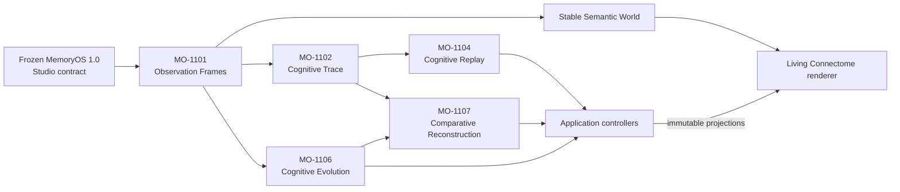

# MemoryOS Studio documentation

This index is the public entry point for the released MemoryOS 1.2 platform,
the MemoryOS 1.1 investigation foundation, and the frozen MemoryOS 1.0 Studio
contract. Read the product journey from top to bottom, or start with the
engineering question you need to answer.

## Start here

| Need | Document |
|---|---|
| Assess MemoryOS against the published platform Standard | [Official conformance suite](../../cca-conformance/README.md) |
| Import, export, or verify a Memory Investigation Package | [Memory Investigation Packages](memory-investigation-packages.md) |
| Translate settled external AI runtime cognition into a verified MIP | [AI Runtime Adapters](ai-runtime-adapters.md) |
| Execute or embed a deterministic investigation | [Investigation Core](investigation-core.md) |
| Define and evaluate deterministic engineering gates | [Investigation Policies](investigation-policies.md) |
| Detect deterministic differences between two investigations | [Cognitive Regression Analysis](cognitive-regression.md) |
| Navigate directly to deterministic regression evidence | [Cognitive Investigation Explorer](cognitive-investigation-explorer.md) |
| Consume MemoryOS from JavaScript, Python, or C++ | [MemoryOS SDK](../../cca-sdk/README.md) · [API reference](../../cca-sdk/docs/api-reference.md) · [Developer guide](../../cca-sdk/docs/developer-guide.md) |
| Audit Investigation Core acceptance evidence | [Investigation Core conformance evidence](investigation-core-conformance-evidence.md) |
| Trace every frozen MIP requirement to implementation and tests | [MIP-001 conformance matrix](mip-conformance-matrix.md) |
| Understand the released Studio contract | [Memory Studio API and behavior](memory-studio.md) |
| Verify the frozen contract against tests | [Memory Studio conformance evidence](memory-studio-conformance-evidence.md) |
| Understand the complete MemoryOS 1.1 investigation stack | [Engineering architecture review](memoryos-1.1-engineering-architecture-review.md) |
| Follow the integrated MemoryOS 1.1 engineering workflow | [Integration & Workflow Unification](memoryos-1.1-integration-workflow.md) |
| Review MemoryOS 1.2 release status | [Release notes](../../../RELEASE_NOTES.md) · [Known issues](../../../KNOWN_ISSUES.md) · [Changelog](../../../CHANGELOG.md) |
| Watch the released product workflow | [Official MemoryOS 1.2 demonstration](media/memoryos-v1.2-demo.gif) · [Full-quality MP4](media/memoryos-v1.2-demo.mp4) |
| Review historical MemoryOS 1.1 engineering and repository evidence | Historical benchmark and audit artifacts are not retained in the v1.2.1 source archive |
| Capture the MemoryOS 1.0 product story | [GitHub screenshot specification](github-screenshot-specification.md) |

## MemoryOS 1.2 integration

MO-1201 implements the frozen MIP-001 contract as a headless package layer.
The [package guide](memory-investigation-packages.md) documents its public
Producer, Consumer, and Verifier operations. The
[64-requirement conformance matrix](mip-conformance-matrix.md) names every
automated test and distinguishes executable package evidence from the two
external assurance/governance reviews.

MO-1202 adds dependency-free adapters for completed OpenAI Agents SDK,
Anthropic SDK, and LangGraph runs. The
[adapter guide](ai-runtime-adapters.md) defines the generic contract,
truth-preservation and failure rules, exact reference packages, and offline
example. Raw events remain private lifecycle-validation input. Only settled,
source-authored cognition crosses the boundary into Observation-only MIPs;
adapters never infer Evidence, Retrieval, Reflection, causality, or provenance
from provider event names.

MO-1203 establishes the [Investigation Core](investigation-core.md) as the
single renderer-independent execution authority. Its immutable, digest-linked
transition log is canonical and all state is derived from that log. It wraps
the released native investigation semantics and owns verified MIP-backed
investigations without projecting an Observation-only MIP into Studio or
inventing absent Trace, Replay, Evolution, or Comparative artifacts. See the
[conformance evidence](investigation-core-conformance-evidence.md).

MO-1204 exposes that frozen Core through the [MemoryOS SDK](../../cca-sdk/README.md).
Studio consumes the browser facade, while Python and native C++ share one
private, long-lived transport implementation. The SDK forwards explicit Core
and MIP operations; it contains no independent Trace, Replay, Evolution, or
Comparative Reconstruction behavior.

MO-1206 adds [Cognitive Regression Analysis](cognitive-regression.md) as a
read-only Investigation Core operation. Its fixed report categories expose
only observed Replay, Reflection, Evidence, Retrieval, Evolution,
Verification, transition, and lifecycle differences. SDK and automation
clients consume the same immutable report and do not implement comparison.

MO-1207 adds the
[Cognitive Investigation Explorer](cognitive-investigation-explorer.md). It
validates detached Regression Reports and follows exact ordered difference
subjects and digest pointers without rerunning Replay, recomputing Regression,
or creating cognitive state. SDK, CLI, and Studio consume the same immutable
Core result.

MO-1208 publishes CCA-MEMORYOS-1.0 outside the implementation workspace and
activates the [official conformance suite](../../cca-conformance/README.md).
MemoryOS 1.2.0 is the initial Reference Implementation; Studio documentation
and source remain informative evidence rather than normative platform text.

MO-1301 begins MemoryOS 1.3 with
[Investigation Policies](investigation-policies.md). The implementation
evaluates closed, versioned Policy/Set artifacts against one atomically
captured Core fact context and at most one trusted Cognitive Regression source.
Evaluation Identity, evidence, resource behavior, outcomes, SDK/CLI transport,
and the MO-1302 handoff are deterministic and versioned; Standard 1.1 remains
deferred until independent conformance and publication review.

The focused edge suites are:

- [`mip_ordering_conformance_test.mjs`](../tests/mip_ordering_conformance_test.mjs)
  for interoperable scalars, occurrences, and Observation chronology;
- [`mip_derived_edge_conformance_test.mjs`](../tests/mip_derived_edge_conformance_test.mjs)
  for multi-branch Trace/Replay and Comparative alignment; and
- [`mip_pipeline_conformance_test.mjs`](../tests/mip_pipeline_conformance_test.mjs)
  for all validation phases, every stable diagnostic, detached publication,
  extension preservation, and lossless compatibility; and
- [`ai_runtime_adapter_test.mjs`](../tests/ai_runtime_adapter_test.mjs)
  for provider lifecycle validation, settled projections, transport
  invariance, failure/resource boundaries, and canonical reference packages;
  and
- [`investigation_core_test.mjs`](../tests/investigation_core_test.mjs)
  for lifecycle, transition-log integrity, checkpoint restoration, native
  semantic parity, verified MIP ownership, thin projections, and atomic failure;
  and
- [`cognitive_regression_test.mjs`](../tests/cognitive_regression_test.mjs)
  for category correctness, ordering, package neutrality, immutability,
  failure atomicity, renderer separation, and bounded deterministic analysis;
  and
- [`cognitive_investigation_explorer_test.mjs`](../tests/cognitive_investigation_explorer_test.mjs)
  for evidence navigation, exact selectors, deterministic JSON, read-only
  behavior, validation, performance, and renderer separation.

## MemoryOS 1.1 milestone map

The standalone MO-1101 and MO-1102 milestone records are not retained in the
v1.2.1 source archive. Their released roles are preserved below and summarized
by the [Engineering architecture review](memoryos-1.1-engineering-architecture-review.md).

| Milestone | Responsibility | Renderer-independent truth |
|---|---|---|
| MO-1101 — Stable Semantic World | Accept immutable observations into deterministic cognitive geography | Observation Frames, canonical identity, stable layout |
| MO-1102 — Cognitive Trace | Reconstruct one Reflection from exact evidence and relationships | Immutable trace membership, order, validation, serialization |
| [MO-1103 — Living Connectome](memoryos-1.1-sprint-3.md) | Present the trace as the dominant investigation | Consumes the Stable Semantic World and Cognitive Trace |
| [MO-1104 — Cognitive Replay](memoryos-1.1-sprint-4.md) | Reveal one real trace element at a time | Immutable replay state and reference-only projection |
| [MO-1105 — Cognitive Polish](memoryos-1.1-sprint-5.md) | Preserve investigation continuity and calm hierarchy | Reuses the existing replay and trace models unchanged |
| [MO-1106 — Cognitive Evolution](memoryos-1.1-cognitive-evolution.md) | Answer “What changed?” across two observations | Canonical semantic differences and stable union world |
| [MO-1107 — Comparative Reconstruction](memoryos-1.1-comparative-reconstruction.md) | Answer “Where did the investigations diverge?” | Deterministic trace alignment and synchronized replay |
| [MO-1108 — Integration & Workflow Unification](memoryos-1.1-integration-workflow.md) | Connect Observe, Trace, Replay, Evolution, and Comparative Reconstruction into one reversible workflow | Existing immutable models plus application-owned checkpoint and graph view state; no new cognitive truth |

## Investigation architecture

The renderer is deliberately downstream. It never constructs traces, decides
replay order, compares observations, aligns investigations, or invents
semantic activity.

## Engineering Excellence evidence

MemoryOS 1.1 performance, scalability, benchmark, UX, accessibility,
documentation-freeze, and repository-audit artifacts are historical and are
not retained in the v1.2.1 source archive. The supported architecture record
is the [Engineering architecture review](memoryos-1.1-engineering-architecture-review.md).

## Genuine visual evidence

The MemoryOS v1.2 assets are repository-hosted captures of the running local
application, not mockups or generated product images. The row below uses
genuine JPEG frames plus the GIF and MP4 exported from the official production
capture. Historical MemoryOS 1.1 milestone screenshots and demonstrations
named by older milestone records are not retained in the v1.2.1 source archive;
those filenames remain provenance-only text in the applicable records.

| Capability | Screenshot evidence | Silent demonstration |
|---|---|---|
| **MemoryOS 1.2 · v1.2.0** | [Mission Control](screenshots/memoryos-v1.2-mission-control.jpg) · [Cognitive Replay](screenshots/memoryos-v1.2-cognitive-replay.jpg) · [Investigation Explorer](screenshots/memoryos-v1.2-investigation-explorer.jpg) | [Official demonstration](media/memoryos-v1.2-demo.gif) · [Full-quality MP4](media/memoryos-v1.2-demo.mp4) |

## Historical release material

- [MemoryOS 1.0 launch demonstration production package](memoryos-1.0-launch-demo-production-package.md)
- [MemoryOS 1.0 GitHub screenshot specification](github-screenshot-specification.md)

These documents remain available as release records. Current MemoryOS 1.2
claims should use the v1.2 evidence indexed above.

The [media manifest](media/README.md) defines the current release, milestone,
source-frame, and archived-asset boundaries.
