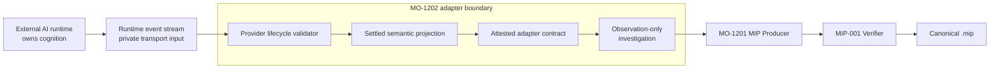

# AI Runtime Adapters

## Purpose

MO-1202 lets an external AI runtime produce a deterministic Memory
Investigation Package without giving MemoryOS ownership of that runtime. An
adapter consumes provider events privately, establishes successful completion,
projects only completed source-authored cognition, and delegates package
construction and verification to the frozen MO-1201 implementation. Transport
events never become MIP records.

The implementation is dependency-free. It does not import an AI SDK, make a
network request, authenticate, execute a tool, start an agent, or change
MemoryOS Runtime or Studio.



MemoryOS observes the settled projection. It does not own the agent, model,
conversation, graph, tools, or provider lifecycle.

## Generic contract

`web/js/ai-runtime-adapter.js` exports:

- `defineAIRuntimeAdapter()` for defining a provider-shaped validator and
  mapper;
- `isAIRuntimeAdapter()` for structural identity checks;
- `snapshotRuntimeEvent()` for a strict canonical data snapshot;
- `AIRuntimeAdapterError` with stable `code` and `eventIndex` fields;
- `AI_RUNTIME_ADAPTER_PRODUCER` for stable package producer metadata; and
- `AI_RUNTIME_ADAPTER_CONTRACT_VERSION`.

Every defined adapter exposes the same immutable interface:

```js
{
  contractVersion,
  descriptor,
  sourceAuthorshipAttested,
  createInvestigation(source, request),
  exportInvestigation(source, request),
  createArtifact(source, request, fileName),
}
```

The `source` may be a synchronous or asynchronous iterable. Provider adapters
may additionally require a settled result surface such as OpenAI `completed`
and `output`, or LangGraph `output`. The request is explicit and contains no
ambient values:

```js
const request = {
  packageIdentifier: "investigation-run-001",
  workspaceIdentifier: "workspace-001",
  observationIdentifier: "runtime-run-001",
  observationSequence: 0,
  sourceVersion: "the-installed-sdk-version",
  // Optional bounded-resource overrides:
  maxEvents: 10_000,
  maxSourceBytes: 8 * 1024 * 1024,
  maxSourceValues: 1_000_000,
  maxPackageBytes: 16 * 1024 * 1024,
};
```

`observationIdentifier` is the caller's stable identity for the captured run or
message. A completed item identifier is preserved when the provider supplies
one. Otherwise the Observation identity plus deterministic occurrence
identifies it. MIP applies its canonical typed-reference order. Source order is
used only to assign occurrences when the source repeats the same kind and
identifier; no adapter bookkeeping is added to cognition. The adapter never
generates a UUID, reads a clock, uses randomness, or rewrites a source
identifier.

Adapter definitions use three sequential hooks: `initialize()` creates private
per-run state, `observeEvent()` validates and aggregates without emitting MIP
data, and mandatory `finalize()` returns an explicitly accepted context-only
projection. Async hooks are awaited. A definition cannot be created without an
explicit source-authorship attestation.

## Truth preservation

The standard adapters deliberately do not translate an SDK event name into a
MemoryOS semantic claim. Raw envelopes, deltas, pings, lifecycle notifications,
timestamps, namespaces, usage telemetry, SDK objects, provider configuration,
and errors are validation input only. They are never serialized.

Each completed semantic item becomes one record with:

- role `context`;
- empty provenance;
- no relationship;
- a canonical, source-faithful settled projection under `revision`;
- its stable source identifier when one exists; and
- adapter and SDK identity in package metadata, outside cognition.

An ordinary model message is not automatically a Reflection. A tool result is
not automatically Evidence or Retrieval. A graph update is not automatically
a Semantic Transformation. Those classifications require source-authored MIP
semantics and provenance that the SDK event surfaces do not provide.

Consequently, reference adapter output is an Observation-only MIP with empty
Trace, Replay, Evolution, and Comparative Reconstruction sections. This is a
complete valid investigation of the settled source output; it is not a
fabricated cognitive explanation.

Determinism is defined over completed cognition, not transport. Equivalent
Anthropic text split across different delta boundaries produces identical MIP
bytes. LangGraph wall-clock timestamps and runtime namespace suffixes do not
change cognition integrity. Adding, removing, or changing a completed semantic
item does.

## Reference adapters

### OpenAI Agents SDK

`openAIAgentsSdkAdapter` consumes an actual `StreamedRunResult`. It validates
the documented stream families:

- `raw_model_stream_event`;
- `run_item_stream_event`; and
- `agent_updated_stream_event`.

It awaits `completed`, rejects errors, cancellation, unresolved interruptions,
failed/incomplete Responses status, and missing model-shaped `output`. The
adapter projects completed assistant text/refusal messages and ordinary
function calls/results from `output`; it never serializes Agent, RunItem,
provider-data, media, reasoning ciphertext, raw response events, or deltas.
Function argument JSON is validated but retained as the exact source string;
string tool results are likewise preserved without parsing or type rewriting.
Unsupported output fails closed instead of being copied wholesale.

The reference shape follows the official
[OpenAI Agents SDK streaming guide](https://openai.github.io/openai-agents-js/guides/streaming/),
[`FunctionCallItem`](https://openai.github.io/openai-agents-js/openai/agents-core/type-aliases/functioncallitem-1/),
and [`FunctionCallResultItem`](https://openai.github.io/openai-agents-js/openai/agents/type-aliases/functioncallresultitem-1/)
contracts.

### Anthropic SDK

`anthropicSdkAdapter` validates one complete Messages stream:

```text
message_start
  content_block_start
  content_block_delta ...
  content_block_stop
  ...
message_delta ...
message_stop
```

Block indices must be contiguous, deltas must target an open block, every
ordinary block requires at least one delta, at least one `message_delta` must
precede `message_stop`, and stop must finish the stream. The documented
zero-delta `fallback` block is accepted as a model-boundary marker and omitted
from cognition. Text deltas are concatenated and tool-input JSON is parsed only
at block completion. `end_turn`, `stop_sequence`, `tool_use`, and `refusal`
are accepted terminal reasons; truncation and continuation reasons fail closed.
Pings, usage, model names, signatures, and stream boundaries are not serialized.
Errors, unsupported semantic block/event types, and unrepresented semantic
members fail closed.

The lifecycle follows Anthropic's official
[Streaming Messages documentation](https://platform.claude.com/docs/en/build-with-claude/streaming)
and [stop-reason guidance](https://platform.claude.com/docs/en/build-with-claude/handling-stop-reasons).

### LangGraph

`langGraphAdapter` accepts the documented v3-style `ProtocolEvent` envelope:

```js
{
  seq,
  method,
  params: { namespace, timestamp, node?, data },
}
```

`seq` must be a strictly increasing non-negative safe integer and is the sole
transport ordering authority. The root lifecycle must begin with `started` and
end with `completed`; `failed`, `interrupted`, missing output, and missing
terminal state reject publication. Timestamps, namespaces, node invocation
identifiers, channel envelopes, and lifecycle values are never serialized.

LangGraph application state is open-ended, so the adapter does not guess which
fields are cognition. The settled `stream.output` must explicitly expose:

```js
{
  memoryosInvestigation: {
    records: [{ identifier, kind, sourceOrder, revision }],
    relationships: [],
  },
}
```

Only that application-designated projection crosses the boundary. Other graph
state remains owned by LangGraph. The designated projection is closed: extra
members fail instead of being silently removed.

The envelope follows LangGraph's official
[Event Streaming documentation](https://docs.langchain.com/oss/javascript/langgraph/event-streaming).

## Failure behavior

The adapter collects into detached local state and publishes only after the
source lifecycle, MIP construction, and MIP verification all succeed. It
rejects atomically when:

- the source is empty, non-iterable, throws, or exceeds `maxEvents`;
- a provider envelope or lifecycle is invalid;
- source order is duplicate or decreasing where an authoritative sequence is
  available;
- the settled projection is ambiguous, unaccepted, cyclic, accessor-backed,
  symbolic, hidden, unsupported structured data, or otherwise not canonical
  JSON;
- the completed projection or package exceeds its bounded resource policy; or
- completed cognition contains content prohibited by MIP-001.

MIP failures remain `MemoryInvestigationPackageError` values with the existing
stable MIP diagnostic. Adapters do not redact rejected content into an
apparently valid package: structured fields and exact values are evaluated by
the frozen MIP-001 verifier, while source-authored strings are preserved
exactly and remain subject to MIP-001's frozen content rules.

The adapter's own stable failure codes are:

| Code | Meaning |
|---|---|
| `EMPTY_RUNTIME_STREAM` | No source event was supplied. |
| `INVALID_RUNTIME_EVENT` | An event or completed projection violates its adapter contract. |
| `EVENT_ORDER_VIOLATION` | An authoritative source sequence did not increase. |
| `INCOMPLETE_RUNTIME_STREAM` | A provider lifecycle ended without successful completion. |
| `RUNTIME_STREAM_FAILURE` | The iterable failed while being consumed. |
| `RUNTIME_EVENT_RESOURCE_LIMIT` | The event-count or event-value policy was exceeded. |

## Example

```js
import { openAIAgentsSdkAdapter } from "./web/js/adapters/openai-agents-sdk-adapter.js";

const artifact = await openAIAgentsSdkAdapter.createArtifact(
  completedAgentsStream,
  {
    packageIdentifier: "investigation-run-001",
    workspaceIdentifier: "workspace-001",
    observationIdentifier: "agents-run-001",
    observationSequence: 0,
    sourceVersion: "your-installed-sdk-version",
  },
  "agents-run-001.mip",
);
```

Run the offline executable example:

```text
node repositories/cca-studio/examples/ai_runtime_adapter_usage.mjs
```

Run the focused conformance suite:

```text
npm --prefix repositories/cca-studio run test:adapters
```

## Reference packages

The repository contains provider-shaped private transport vectors, settled
output projections, and their exact canonical packages:

| Adapter | Transport vector | Settled output | Canonical package |
|---|---|---|---|
| OpenAI Agents SDK | [`openai-agents.events.json`](../tests/fixtures/adapters/openai-agents.events.json) | [`openai-agents.output.json`](../tests/fixtures/adapters/openai-agents.output.json) | [`openai-agents-reference.mip`](../examples/ai-runtime-adapters/reference-packages/openai-agents-reference.mip) |
| Anthropic SDK | [`anthropic.events.json`](../tests/fixtures/adapters/anthropic.events.json) | Reconstructed completed Message | [`anthropic-reference.mip`](../examples/ai-runtime-adapters/reference-packages/anthropic-reference.mip) |
| LangGraph | [`langgraph.events.json`](../tests/fixtures/adapters/langgraph.events.json) | [`langgraph.output.json`](../tests/fixtures/adapters/langgraph.output.json) | [`langgraph-reference.mip`](../examples/ai-runtime-adapters/reference-packages/langgraph-reference.mip) |

Regenerate them deterministically with:

```text
node repositories/cca-studio/scripts/generate-ai-runtime-adapter-fixtures.mjs
```

The adapter test locks every reference package's byte length, SHA-256, package
digest, and cognition digest, then verifies it independently through MO-1201.

## Non-goals

MO-1202 does not provide SDK dependencies, API clients, authentication,
networking, retries, rate limits, tool execution, provider ownership, storage,
polling, UI changes, renderer behavior, Runtime changes, MIP changes, model
summaries, inferred explanations, or inferred provenance. Adapters translate
only settled, source-authored cognition supplied through provider result
surfaces. MemoryOS investigates the resulting package.
