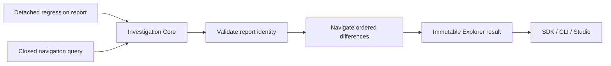

# Cognitive Investigation Explorer

## Purpose

MO-1207 navigates the deterministic evidence already present in a Cognitive
Regression Report. It lets a client locate Replay, Reflection, Evidence,
Retrieval, Evolution, Verification, transition, and lifecycle differences
without rerunning either investigation.



The Explorer does not compare investigations, execute Replay, derive a Trace,
rank evidence, or produce an explanation. `InvestigationCore.investigate()` is
the only execution entry point used by platform consumers.

## Query contract

A query is normalized to exactly three members:

| Member | Value | Meaning |
| --- | --- | --- |
| `category` | a fixed regression category or `null` | Select one factual category. |
| `reflectionIdentifier` | non-empty string or `null` | Select one exact Reflection identity. |
| `transition` | non-empty string or `null` | Select an exact transition kind, action, or lifecycle state. |

The fixed categories are `replay`, `reflection`, `evidence`, `retrieval`,
`evolution`, `verification`, `transition`, and `lifecycle`. Reflection and
transition selectors are mutually exclusive. Unknown members and invalid
selector combinations fail before a result is published.

Transition selectors normalize ASCII case, spaces, underscores, and
camel-case boundaries to hyphenated form. For example, `ReplayComplete` and
`replay-complete` select the same factual lifecycle locator. This is lexical
normalization only; it does not infer a transition.

Reports emitted before MO-1207 remain valid for complete and category
navigation. An exact transition selector returns `empty` when that older
report does not carry the additive transition locator; the Explorer never
reconstructs or invents the missing token.

## Result contract

Every result has kind `MemoryOSCognitiveInvestigationResult`, version `1.0.0`,
and a canonical content-derived identifier. `matches` remain in the fixed
regression category order and then in the report's existing difference order.
Each match contains:

- its zero-based result index;
- the factual category, change kind, and unchanged regression subject; and
- nullable baseline and candidate endpoints.

An endpoint contains the source identity and source kind, the existing fact
digest, and an RFC 6901-compatible pointer to that digest in the authoritative
report. Added evidence has only a candidate endpoint, removed evidence has
only a baseline endpoint, and modified evidence has both. The result copies no
semantic payload and cannot become alternate cognitive truth.

`status` is exactly `matched` or `empty`; an empty selection is not an error.
The complete result is recursively immutable.

## JavaScript example

```js
const report = core.regression(baseline.identifier, candidate.identifier);
const result = core.investigate(JSON.parse(JSON.stringify(report)), {
  reflectionIdentifier: "reflection-17",
});
```

The executable example is
[`cognitive_investigation_explorer_usage.mjs`](../examples/cognitive_investigation_explorer_usage.mjs).

Memory Studio accepts an existing regression JSON report directly from the
semantic world, before Trace, Replay, or Cognitive Evolution is active. The
file is passed to the public SDK for validation and navigation; Studio does
not recreate either source Investigation or compute a replacement report. A
report from another Workspace is rejected before it is shown in the active
Studio Workspace. A factual node locator is enabled only when that exact node
exists in the active observed frame.

## Failure behavior

The Core reports malformed or tampered input as `INVALID_REGRESSION_REPORT`
and malformed or contradictory selection as `INVALID_QUERY`, both for the
`investigate` operation. It canonical-clones detached JSON before validating the closed
Regression Report contract and its content-derived identifier. Malformed,
tampered, non-canonical, or unsupported reports fail safely. Invalid queries
fail before traversal. Navigation is read-only and appends no transition,
changes no lifecycle, and modifies no investigation or report.

## Related documents

- [Engineering guide](cognitive-investigation-explorer-engineering-guide.md)
- [Architecture review](cognitive-investigation-explorer-architecture-review.md)
- [Conformance report](cognitive-investigation-explorer-conformance-report.md)
- [Cognitive Regression Analysis](cognitive-regression.md)
- [Investigation Core](investigation-core.md)
