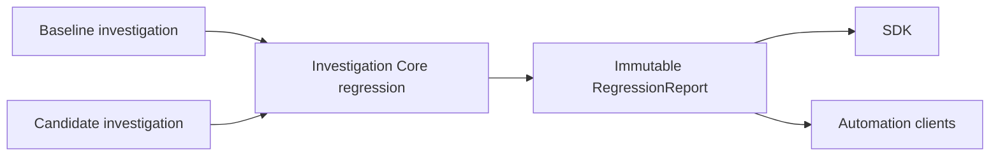

# Cognitive Regression Analysis

## Purpose

MO-1206 compares two immutable investigations and reports only deterministic
differences already represented by the Investigation Core. It answers whether
cognition changed; it does not explain, score, rank, infer, or summarize why.



The operation is read-only. It appends no transition, changes no lifecycle,
and never modifies either investigation.

## Compatibility boundary

A comparison requires both investigations to:

- belong to the same Workspace; and
- use the same source kind (`native` or `mip`).

Local import aliases, package metadata, non-critical extensions, layout,
presentation state, and renderer state are excluded. For a `PACKAGE_IMPORTED`
transition, regression observes only the verified `cognitionDigest`. For a
native `OBSERVED` transition, its accepted snapshot participates in the fact
digest so earlier Observation truth remains detectable after later states
converge; snapshot content is never copied into the report.

## Fixed report contract

Every report has kind `MemoryOSCognitiveRegressionReport` and version `1.0.0`.
Categories always appear in this order:

1. `replay`
2. `reflection`
3. `evidence`
4. `retrieval`
5. `evolution` (semantic transformations, semantic relationships, and exact
   Evolution artifacts)
6. `verification`
7. `transition`
8. `lifecycle`

A category is `identical` when it has no differences and `changed` otherwise.
Differences are ordered by canonical subject identity and use exactly
`added`, `removed`, or `modified`. Before and after values are represented by
domain-separated SHA-256 digests, so reports disclose differences without
duplicating semantic payloads.

Transition and lifecycle subjects include additive factual navigation
locators. These expose only the compared transition kind/action and lifecycle
state and preserve the closed top-level report contract. MO-1207 uses them for
exact navigation; they contain no explanation or inferred meaning.

`regressionDetected` is true when any category changed. `overall` is exactly
`identical` or `regressionDetected` and contains no severity or interpretation.

The machine-readable contract is
[cognitive-regression-report-1.0.schema.json](schemas/cognitive-regression-report-1.0.schema.json).

## JavaScript SDK example

```js
import { MemoryOS } from "./web/js/memoryos-sdk.js";

const memoryos = new MemoryOS();
const workspace = memoryos.openWorkspace("workspace-001");
const baseline = memoryos.observe(workspace, baselineSnapshot, {
  identifier: "baseline",
});
const candidate = memoryos.observe(workspace, candidateSnapshot, {
  identifier: "candidate",
});

const report = memoryos.regression(baseline, candidate);
if (report.regressionDetected) {
  for (const category of report.categories) {
    if (category.status === "changed") console.log(category.category);
  }
}
```

The facade accepts only investigations owned by that `MemoryOS` instance.
Callers receive an immutable `RegressionReport`; all comparison behavior remains
inside the Investigation Core.

## Failure behavior

Unknown investigations fail with `NOT_FOUND`. Workspace or source-kind
mismatches fail with `WORKSPACE_MISMATCH` or `SOURCE_KIND_MISMATCH`. A failure
publishes no report and leaves both transition logs and derived states intact.

## Related documents

- [Engineering guide](cognitive-regression-engineering-guide.md)
- [Conformance report](cognitive-regression-conformance-report.md)
- [Investigation Core](investigation-core.md)
- [Cognitive Investigation Explorer](cognitive-investigation-explorer.md)
