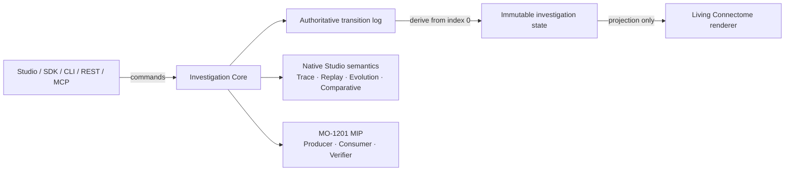
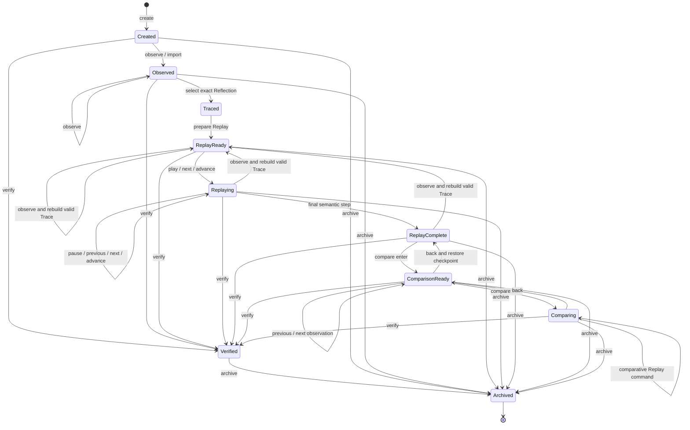

# Investigation Core

## Purpose

MO-1203 establishes one renderer-independent execution authority for deterministic
MemoryOS investigations. Studio and future SDK, CLI, REST, and MCP clients issue
commands to `InvestigationCore`; they do not implement Trace, Replay, Cognitive
Evolution, Comparative Reconstruction, or MIP semantics themselves.

The Core wraps the released MemoryOS algorithms without changing them. For a
native Studio observation it derives the same Trace, Replay, Evolution, and
Comparative Reconstruction values used by MemoryOS 1.1. For a MIP-backed
investigation it accepts only a package that passes the frozen MIP-001 verifier
and exposes only source-authored artifacts already present in that package.

The renderer consumes `projectInvestigation()` output. It never computes an
investigation transition or semantic artifact.

## Public module

`web/js/investigation-core.js` exports the following immutable values:

- `InvestigationCore`, `Investigation`, `InvestigationState`, and
  `InvestigationCoreError`;
- `Transition` and `TransitionLog`;
- `Checkpoint`, `ReplaySession`, `ComparisonSession`, and
  `VerificationSession`;
- immutable Cognitive Regression reports through `InvestigationCore.regression()`;
- immutable Cognitive Investigation Explorer results through
  `InvestigationCore.investigate()`;
- `LifecycleState`, `investigationPhase()`, `investigationAvailability()`, and
  `projectInvestigation()`.

All returned records are immutable. Failures throw `InvestigationCoreError`
with a stable `code`, `operation`, and immutable diagnostic list.

## Required operations

| Operation | Contract |
| --- | --- |
| `create(input)` | Creates one native investigation for an exact Workspace. An optional initial snapshot is accepted as the first observation. Duplicate identifiers fail. |
| `load(identifier)` | Re-derives immutable state from the stored transition log. It does not read renderer state. |
| `restore(checkpoint)` | Restores only an intact checkpoint whose log digest, transition count, Workspace, and derived-state digest agree. It never overwrites a different stored log. |
| `archive(identifier)` | Appends the terminal `ARCHIVED` transition. Archived investigations remain loadable and checkpointable but cannot be mutated. |
| `replay(identifier, action)` | Applies `play`, `pause`, `restart`, `previous`, `next`, or `advance` to the existing deterministic Replay. A no-op does not append a transition. |
| `compare(identifier, command)` | Enters or navigates Evolution and Comparative Reconstruction using `enter`, `previous`, `next`, `start`, `play`, `pause`, `reset`, `previousStep`, `nextStep`, `advance`, or `back`. |
| `regression(baselineIdentifier, candidateIdentifier)` | Compares two immutable same-Workspace, same-source-kind investigations without appending a transition. Returns the fixed eight-category Cognitive Regression report. |
| `investigate(report, query)` | Validates and navigates exact differences in an existing Cognitive Regression Report. It never recomputes Regression or replays either investigation. |
| `verify(identifier)` | Re-derives and validates the transition chain and every active native artifact, or independently verifies the stored MIP. It appends `VERIFIED` only after all checks pass. |
| `checkpoint(identifier)` | Captures the authoritative transition log, its digest and count, and a digest of derived state. A checkpoint is not an alternate state store. |
| `export(identifier, options)` | Serializes the exact verified package owned by a MIP-backed investigation using MO-1201. Native Studio investigations are not projected into MIP. |
| `import(input, options)` | Imports and verifies MIP bytes, then creates a MIP-backed investigation bound to the package Workspace. |

The native-client conveniences `observe()`, `trace()`, and `returnToWorld()` are
also Core commands. `trace()` atomically selects one exact Reflection and
prepares its Replay. They keep UI event handling thin while retaining one
implementation of investigation behavior.

## Lifecycle

The exact lifecycle states are:

`Created`, `Observed`, `Traced`, `ReplayReady`, `Replaying`,
`ReplayComplete`, `ComparisonReady`, `Comparing`, `Verified`, and `Archived`.

`Traced` is an explicit derived state even though the public `trace()` command
commits trace selection and Replay preparation together and normally returns
`ReplayReady`. `returnToWorld()` clears active investigation artifacts and
returns to `Observed` (or `Created` if no observation exists). A later valid
command may move a verified, non-archived investigation to the state derived by
that command; `Archived` alone is terminal.
Any command after `Verified` invalidates the point-in-time verification session;
the new state must be verified again. Archiving preserves the last valid
verification evidence.

When a native observation is accepted during an active investigation, the Core
rebuilds the same exact Reflection Trace against the new immutable frame and
prepares Replay again. If that Reflection can no longer produce a valid Trace,
the observation still remains accepted, the lifecycle returns to `Observed`,
and the deterministic rejection diagnostic is retained. Spatial selection,
camera, and Follow behavior remain presentation state owned by Studio.

## Transition log and derived state

The transition log is the canonical source of investigation truth.

1. Indices are contiguous, start at zero, and are never rewritten.
2. Every transition binds `previousLogDigest` to the digest of the complete
   preceding log.
3. Every transition identifier hashes its canonical content, index, kind,
   investigation identifier, and preceding-log digest.
4. The log digest hashes the canonical ordered transition material.
5. Every command builds a candidate log and derives state from transition zero.
   The candidate is published only if complete derivation succeeds.
6. Loading and verification always derive state again. Mutable renderer or
   controller caches are never authoritative.

The defined transition kinds are `CREATED`, `OBSERVED`, `PACKAGE_IMPORTED`,
`TRACE_SELECTED`, `REPLAY_PREPARED`, `REPLAY_ACTION`, `EVOLUTION_ENTERED`,
`EVOLUTION_MOVED`, `COMPARATIVE_ENTERED`, `COMPARATIVE_ACTION`,
`COMPARATIVE_LEFT`, `EVOLUTION_LEFT`, `RETURNED_TO_WORLD`, `VERIFIED`, and
`ARCHIVED`.

## Checkpoints

A checkpoint is an integrity-bound restoration handle. It contains the immutable
transition log, log digest, transition count, Workspace identifier, and a digest
of the state derived at capture time. Restoration:

- verifies the transition chain and all cached digests;
- re-derives state rather than trusting cached projections;
- rejects Workspace or state mismatches;
- rejects replacement of an existing investigation with a different log; and
- publishes nothing on failure.

Checkpoints contain no DOM state, camera state, selected panel, layout preference,
timer, network handle, provider SDK object, or runtime transport event.

## Native and MIP-backed investigations

The two source kinds deliberately have different ingestion boundaries:

| Source | Authority | Available cognition |
| --- | --- | --- |
| Native Studio observation | Released Studio snapshot plus the existing deterministic MemoryOS 1.1 algorithms | Core derives Trace, Replay, Evolution, and Comparative Reconstruction exactly as those algorithms define them. |
| Imported MIP | Frozen MIP-001 package verified by MO-1201 | Core selects only source-authored Observation, Trace, Replay, Evolution, and Comparative Reconstruction sections already present in the package. |

Imported artifacts retain their exact MIP shapes. Core-specific Replay and
Comparative views are explicitly identified as package projections; partial MIP
records are never labeled as native MemoryOS 1.1 artifacts.

The Core does **not** invent a MIP-to-Studio projection. In particular, an
Observation-only package produced by an MO-1202 adapter remains
Observation-only: Trace, Replay, Evolution, and Comparative Reconstruction are
unavailable unless the package author supplied those sections. Conversely,
native Studio state cannot be exported as MIP because no frozen Studio-to-MIP
mapping exists. These boundaries prevent duplicated or inferred cognition.

## Determinism and ownership

- One investigation belongs to one exact Workspace for its lifetime.
- Commands operate on detached canonical input and publish immutable output.
- Replay and comparison consume existing deterministic artifacts.
- Regression compares source-authored cognition and Core truth, excluding local aliases, package compatibility metadata, and all presentation state.
- Investigation navigation follows only validated Regression Report subjects and digest pointers; it does not execute cognition.
- No random number, wall clock, timer, polling loop, network request, provider
  SDK, DOM, or rendering API participates in Core execution.
- Failures leave the previously published log and state unchanged.

## Example and evidence

- [Investigation Core example](../examples/investigation_core_usage.mjs)
- [Conformance evidence](investigation-core-conformance-evidence.md)
- [Memory Investigation Packages](memory-investigation-packages.md)
- [AI Runtime Adapters](ai-runtime-adapters.md)
- [Cognitive Regression Analysis](cognitive-regression.md)
- [Cognitive Investigation Explorer](cognitive-investigation-explorer.md)
