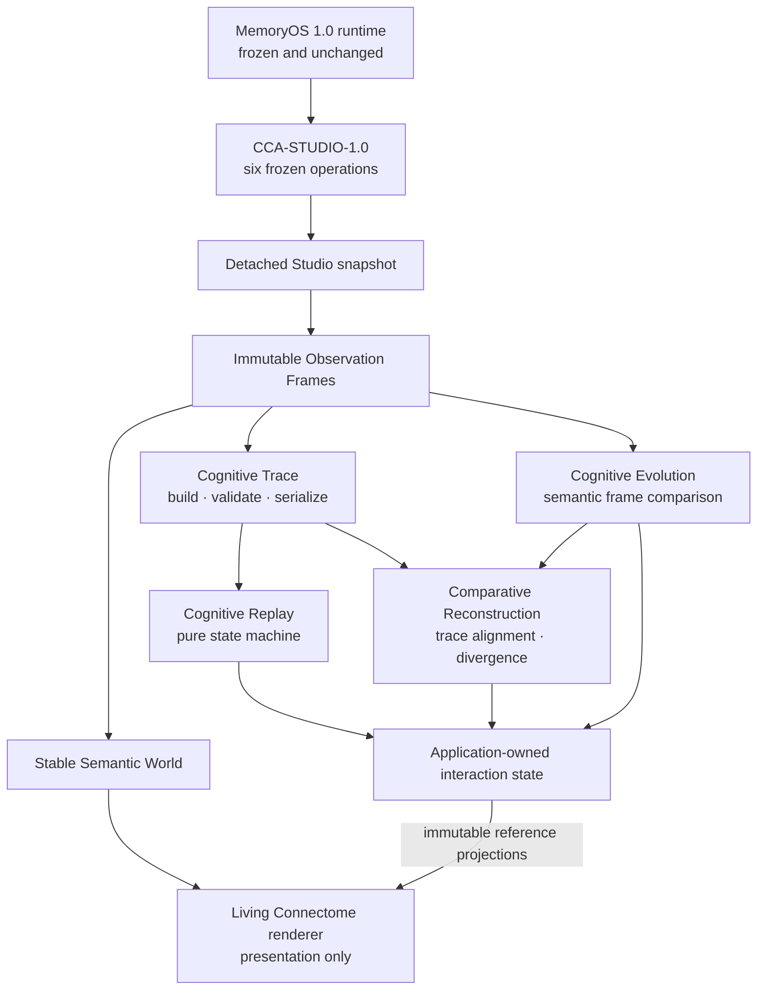

# MemoryOS 1.1 Engineering Architecture Review

## Purpose

This review verifies that the completed MemoryOS 1.1 investigation stack
remains an additive, deterministic presentation over the frozen MemoryOS 1.0
runtime and CCA-STUDIO-1.0 public contract.

The review introduces no architecture, API, capability, or implementation
behavior.

## Reviewed boundary

## Architectural invariants

| Invariant | Review evidence |
|---|---|
| MemoryOS 1.0 remains authoritative. | The 1.1 implementation is confined to the downstream dependency-free web presentation; the frozen C++ header and runtime are not part of the milestone dependency chain. |
| Observations are detached. | The host adapter accepts complete operation results. No 1.1 model owns, polls, or mutates MemoryOS state. |
| Semantic geography is deterministic. | Observation acceptance and semantic-world construction own stable identity and layout; no investigation engine computes rendering coordinates. |
| Traces are renderer-independent. | `cognitive-trace.js` owns construction, validation, querying, and serialization without a DOM or renderer dependency. |
| Replay reconstructs truth rather than inventing activity. | `cognitive-replay.js` projects only ordered references already present in an immutable trace. The application owns explicit scheduling; elapsed time never determines semantics. |
| Evolution compares cognition rather than presentation. | `cognitive-evolution.js` compares canonical semantic records and relationships, not layout, camera, DOM state, or pixels. |
| Comparative Reconstruction aligns investigations rather than graphs. | `cognitive-comparative-reconstruction.js` consumes validated traces and exact bound frames, emits canonical divergence reasons, and reuses the stable Evolution union world. |
| The renderer does not compute investigations. | `graph.js` imports semantic layout/view helpers but not trace, replay, evolution, or comparative engines. It consumes completed classifications and projections. |
| Interaction is explicit. | Controllers own finite ready/playing/paused/completed or comparison state; the application enters Replay, Evolution, or Comparative Reconstruction only after engineer action. |
| No semantic information is duplicated. | Trace, replay, evolution, and comparative values retain stable keys, fingerprints, frame references, and relationship references rather than copying authoritative knowledge payloads. |

## Milestone dependency assessment

| Milestone | Depends on | Does not redesign |
|---|---|---|
| MO-1101 Stable Semantic World | Detached Studio observation | MemoryOS 1.0 runtime or C++ contract |
| MO-1102 Cognitive Trace | Exact Observation Frame and Semantic World references | Renderer or runtime |
| MO-1103 Living Connectome | Stable geography and validated trace | Trace construction or semantic truth |
| MO-1104 Cognitive Replay | Immutable Cognitive Trace | Trace ordering or runtime events |
| MO-1105 Cognitive Polish | Existing renderer and replay projections | Runtime, trace, or replay model |
| MO-1106 Cognitive Evolution | Two immutable Observation Frames | Replay, trace, layout, or renderer |
| MO-1107 Comparative Reconstruction | Two validated traces, bound frames, replay ordering, and Evolution union world | Runtime, Replay, Evolution, or Living Connectome geography |
| MO-1108 Integration & Workflow Unification | The complete feature set and its Engineering Excellence evidence | Any prior architecture or capability |

## Dependency-direction review

The dependency direction remains acyclic:

1. detached contract values feed immutable observation frames;
2. semantic engines derive immutable reference models;
3. application controllers own explicit interaction state;
4. the renderer consumes stable world and view projections; and
5. no lower layer imports the application or renderer.

The one intentional engine reuse in Comparative Reconstruction is downward:
it uses Cognitive Replay ordering, Cognitive Trace validation, and Cognitive
Evolution frame/union-world validation. None of those modules depends on the
comparative engine.

## Explicit exclusions

The reviewed architecture contains no Time Machine, Semantic Zoom,
Investigation Package, Counterfactual Replay, AI explanation, synthetic
cognition, runtime redesign, force-directed layout, or renderer-side semantic
comparison.

## Review result

**Architecture review: conformant.** MemoryOS 1.1 remains a deterministic,
renderer-independent investigation layer over frozen MemoryOS 1.0 behavior.
MO-1108 hardened performance, accessibility, interaction, documentation, and
release evidence without introducing another architecture layer.
