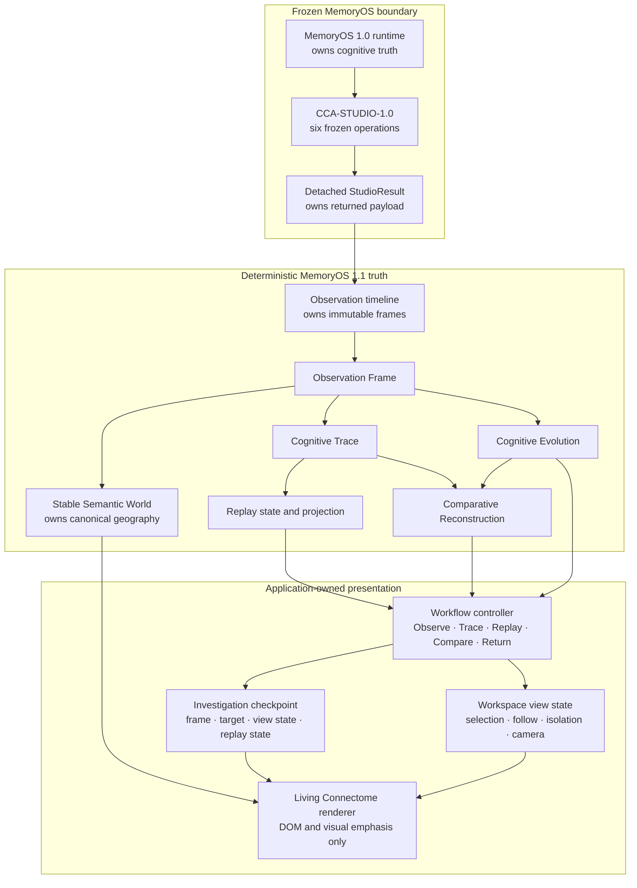
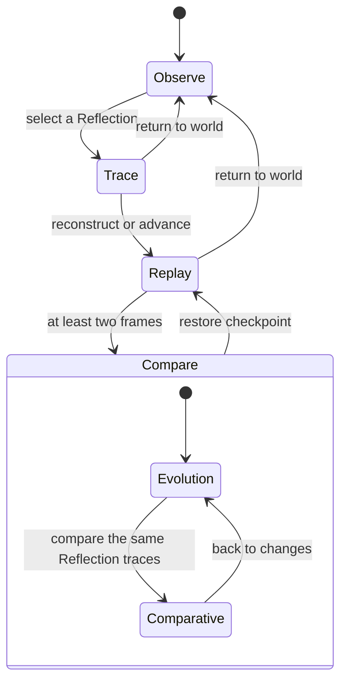

# MemoryOS 1.1 MO-1108 — Integration & Workflow Unification

[MemoryOS Studio documentation index](README.md)

## Purpose

This document records the completed pre-implementation architecture review for
MO-1101 through MO-1107 and defines the minimal integration contract for the
MemoryOS 1.1 release candidate. The milestone connects the existing
investigation capabilities into one workflow. It does not add cognitive truth,
change the frozen MemoryOS 1.0 runtime, or alter the six-operation
CCA-STUDIO-1.0 public Contract.

Architecture review and implementation validation are complete. The automated
and production-browser evidence is recorded in
[Validation status](#validation-status).

## Pre-implementation architecture review

The review was completed before the integration changes were selected. It
traced each milestone from its immutable input through its controller and into
the Living Connectome. It also audited the application shell, every visible
graph control, graph density at the default camera, result presentation, and
the paths between investigation modes.

| Existing milestone | Authoritative responsibility | Integration finding | Frozen decision |
|---|---|---|---|
| MO-1101 Observable Foundation | Accept detached observations as immutable frames and construct stable semantic geography. | Observation acceptance and geography were correct, but the shell did not make the observation-to-investigation path explicit. | Reuse the frame timeline and world unchanged; make Observe the workflow entry. |
| MO-1102 Cognitive Trace | Build, validate, query, and serialize a deterministic evidence-to-Reflection trace. | Selecting a Reflection established the right trace, but Trace did not read as a distinct stage. | Reuse the trace unchanged; expose a Trace checkpoint before Replay advances. |
| MO-1103 Living Connectome | Render the stable world and validated investigation projections. | The graph was semantically correct but crowded at 100%, and cognitive regions were passive decoration. | Preserve all semantic coordinates; add presentation-only viewport padding, region isolation, and investigation focus. |
| MO-1104 Cognitive Replay | Advance an immutable trace through a pure replay state machine. | Replay controls worked in isolation, but comparison required leaving the investigation without an explicit return path. | Reuse Replay unchanged; capture its exact presentation checkpoint before Compare and restore it on return. |
| MO-1105 Cognitive Polish | Maintain calm hierarchy and investigation continuity. | The hierarchy inside an active trace was sound, but mode changes were still communicated by separate feature-specific controls. | Keep its visual semantics; add one shared workflow indicator and contextual actions. |
| MO-1106 Cognitive Evolution | Compare two immutable Observation Frames by semantic identity and revision. | Evolution correctly answered “What changed?” but appeared as a separate graph mode. | Make Evolution the first Compare stage and preserve the prior Trace/Replay checkpoint. |
| MO-1107 Comparative Reconstruction | Align two validated traces and pause synchronized replay at exact divergence. | Reconstruction correctly answered “Where?” but its entry and return path depended on local panel knowledge. | Keep one union world; enter it from Compare and return first to changes, then to the captured investigation. |

The review found no need for a seventh engine, a new public operation, a new
runtime abstraction, or a new semantic record. The integration belongs in
application-owned interaction state and renderer-owned view state.

## Frozen boundaries

The following boundaries remain unchanged:

- MemoryOS 1.0 owns authoritative cognition and lifecycle behavior.
- CCA-STUDIO-1.0 exposes exactly `observe`, `inspect`, `trace`, `summarize`,
  `exportView`, and `forgetSession`.
- The host boundary supplies complete detached operation Results. It does not
  grant the web presentation live access to MemoryOS state.
- Observation Frames, Cognitive Traces, replay projections, Evolution
  comparisons, and Comparative Reconstructions remain deterministic,
  immutable engine values.
- The Stable Semantic World remains coordinate-authoritative. Camera and
  emphasis changes never rewrite its layout or fingerprints.
- The Living Connectome renderer consumes prepared values. It does not build a
  trace, order replay, compare frames, align investigations, or infer meaning.

MO-1108 introduces no Time Machine, Counterfactual Replay, Semantic Zoom,
runtime mutation, force-directed layout, polling, synthetic activity, AI
summary, or editable cognition.

## Dependency and ownership model

The application owns explicit commands and finite presentation timers. The
renderer owns mounted elements and camera transforms. Neither owns or edits
MemoryOS cognition. The renderer continues to import only stable-world and
graph-view helpers; semantic investigation engines remain upstream.

## Unified investigation workflow

The primary interaction model is one visible progression:

The user-facing rail condenses both comparison substates under **Compare** so
the engineer keeps one mental model: Observe → Trace → Replay → Compare →
Return. Context copy identifies whether Compare is showing semantic changes or
synchronized divergence.

| Action | Preconditions | Exact transition |
|---|---|---|
| Observe | Always available while the detached session exists. | In Observe, focuses the semantic world. From another phase, clears only presentation investigation state and returns to the current observed world. |
| Trace | A validated Reflection trace is active or checkpointed. | Restores the checkpoint when returning from comparison, resets Replay to its ready cursor, selects the target Reflection, and focuses it. |
| Replay | A validated trace and replay value exist. | Starts the existing replay; if complete, restarts it. Replay order and content remain engine-owned. |
| Compare | At least two immutable Observation Frames exist. | From Trace/Replay, captures the checkpoint and enters Evolution. From Evolution, enters Comparative Reconstruction for the same exact Reflection when both frames contain it. |
| Return | A non-Observe phase is active. | Comparative returns to Evolution; Evolution restores the captured Trace/Replay; Trace/Replay returns to the unmodified semantic world. |

Unavailable workflow actions remain visible only when their next requirement
is understandable. Their `title` and accessible description state the exact
reason, such as “Select a Reflection to establish a deterministic Cognitive
Trace” or “Observe another frame to compare deterministic cognition.”

## Exact investigation checkpoint restoration

Entering Compare from an active Trace or Replay captures only presentation
state:

1. the exact Observation Frame identifier;
2. the Cognitive Trace target node key;
3. the selected graph key, Follow target, isolated region, interaction mode,
   and camera transform; and
4. the immutable Replay identifier, status, cursor, and completed references
   returned by the existing replay snapshot function.

Evolution then becomes the active renderer mode; it does not retain a second
copy of the trace's semantic payload. Comparative Reconstruction remains a
substate of that same comparison.

On **Back to replay**, restoration is permitted only when the checkpoint still
names the current exact frame. The application rebuilds the trace from the
stable target key, reconciles graph keys against that frame, restores the
target Reflection and its newly resolved detached observations, restores the
valid Follow, isolation, interaction-mode, and camera state, and restores
Replay only when the rebuilt replay identifier matches the checkpoint. The
target Reflection intentionally becomes the selected context anchor rather
than retaining an inspector value from a prior render. A stale frame, missing
target, or replay-identity mismatch is rejected instead of attaching old
presentation state to new cognition.

This gives Compare a reversible investigation boundary without changing an
Observation Frame, trace, replay, comparison, or runtime value.

## Investigation workspace interaction

The graph is an engineering workspace, but its controls remain strictly
view-only:

| Interaction | Behavior | Semantic effect |
|---|---|---|
| Select | Selects one exact observed node and presents its detached values. Arrow-key spatial navigation uses the stable geography. | None. |
| Pan | Allows pointer drag and keyboard camera movement; manual pan ends Follow so the camera never fights the engineer. | None. |
| Follow / Follow trace | Keeps the camera on the selected node or moves through validated trace membership. | None. |
| Isolate region | Activating a cognitive-region boundary or layer control sets one presentation filter. Activating the same region again, or choosing All layers, restores the world. | None; nodes and relationships remain present in the semantic world. |
| Focus investigation | Fits the camera around the active trace, Evolution changes, or Comparative Reconstruction references. It appears only when an investigation supplies focusable keys. | None. |
| Fit | Ends Follow and resets the camera to the calibrated 100% working view. | None. |
| Zoom | Adjusts the camera within the renderer's bounded scale range and reports the exact percentage. | None. |

Region boundaries are keyboard-operable buttons with pressed state; the layer
legend exposes the same isolation state. Region isolation, selection, Follow,
interaction mode, and camera are emitted as graph view state to the
application. They are not added to an Observation Frame or an exported Studio
view.

Pinning, collapsing, saved layouts, and custom views were reviewed as possible
workspace interactions. They are intentionally not introduced by this minimal
integration because the connected workflow, isolation, Focus, and Fit meet the
identified control gap without adding another persistence or workspace-state
contract. No inactive placeholder controls for those ideas are shown.

## Calibrated 100% view

The stable semantic layout remains `960 × 540`; every node coordinate and
layout fingerprint is unchanged. The renderer now presents that world through
a padded `1104 × 624` view box, offset by `−72, −42` while retaining the same
centre. Therefore:

- 100% means a comfortable working composition with breathing room around the
  semantic topology;
- Fit returns to that composition rather than calculating a maximum-fill
  bounding box;
- graph labels and region labels have more separation at the default camera;
- Focus investigation may temporarily calculate a bounded camera fit around
  the current investigation; and
- zoom, pan, Follow, and Fit change only the camera transform.

This recalibration reduces density without moving cognition. Stable geography
remains suitable for spatial memory and deterministic comparisons.

## Frozen operations in the integrated product

The existing operation deck and session actions remain available. They are
not replaced by the investigation workflow, because each is a frozen public
Contract operation with a distinct detached Result.

| Frozen operation | Product surface | Result behavior |
|---|---|---|
| `observe` | **Observe view** | Accepts a successful detached view as the next immutable Observation Frame. It does not poll or subscribe to MemoryOS. |
| `inspect` | **Inspect** | Selects exact paths and opens the inspector with values resolved from the independent returned view. |
| `trace` | **Evidence report** | Opens exact explanation chains as a detached evidence report. This CP-011 operation is deliberately distinguished from the interactive renderer-independent Cognitive Trace. |
| `summarize` | **View summary** | Opens the ordered mechanical `key=value` observations in the inspector. It adds no inferred health or AI explanation. |
| `exportView` | **Export view** | Opens the independently returned view and offers a presentation-layer JSON download. The frozen engine operation itself remains an in-process detached copy with no transport side effect. |
| `forgetSession` | **Forget session** | Uses explicit confirmation, then clears only the detached Studio session and its presentation timeline. MemoryOS source cognition remains unchanged. |

Evidence, Summary, and Export Results are surfaced in a focused inspector
instead of only a transient notification. The latest operation code and
message also remain available as a compact status disclosure. Earlier Results
retain their Contract ownership and are never rewritten by graph interaction.

## Toolbar and panel contract

Every visible control must perform an existing action or expose an exact
disabled reason. The shared disabled-control helper applies a reason through
both a tooltip and an accessible description. This includes:

- Follow before a node or trace step is available;
- Previous, Play, Pause, Next, and Restart at replay boundaries;
- synchronized-reconstruction controls at ready, playing, divergence, and
  completion boundaries; and
- Previous Observation, Compare, and Next Observation when frame history or
  pair position prevents the action.

There are no decorative toolbar buttons. Controls that have no valid action
in the current mode are omitted rather than left inert.

Context presentation follows the active investigation. Observe shows the
current perspective or Reflection convergence entry. Trace and Replay show the
current real semantic element. Evolution shows exact additions, removals,
modifications, and stable counts. Comparative Reconstruction shows the two
aligned observations and the exact divergence reason. The surrounding world
remains mounted for orientation.

## Renderer separation

The integration does not move business logic into `graph.js`:

- trace construction and validation remain in `cognitive-trace.js`;
- replay ordering and state transitions remain in `cognitive-replay.js`;
- frame comparison remains in `cognitive-evolution.js`;
- trace alignment and divergence remain in
  `cognitive-comparative-reconstruction.js`;
- synchronized replay remains in `cognitive-comparative-replay.js`; and
- `app.js` owns explicit workflow commands, checkpoints, and finite timers.

The renderer receives a Stable Semantic World plus mutually exclusive Trace,
Evolution, or Comparative projection state. It may calculate SVG geometry,
camera focus, visible emphasis, accessibility labels, and presentation-only
region isolation. It cannot manufacture an investigation element or semantic
difference.

## Validation status

| Gate | Required evidence | Status |
|---|---|---|
| Architecture | Frozen boundary, dependency direction, ownership, and renderer-import review. | Complete; recorded above. |
| Automated behavior | Existing Studio tests plus deterministic workflow, checkpoint restoration, region isolation, viewport calibration, disabled-reason, and renderer-separation coverage. | Complete: `npm test` passed 79/79. |
| Scalability | Stable geography, the full investigation pipeline, packed alignment, dense rendering, and locale-independent ordering through 10,000 nodes. | Complete: `npm run test:scalability` passed 6/6. |
| Workspace integrity | Repository organization and required artifacts remain valid; no backend, runtime, public API, or specification file is changed by MO-1108. | Complete: `tools/verify_workspace.py --root .` passed. |
| Desktop browser | Observe → Trace → Replay → Compare → Comparative → Back to changes → Back to replay → Return, with toolbar, region isolation, Focus, Fit, zoom, and route cleanup exercised. | Complete at 1280 × 720; no console errors or warnings and no horizontal overflow. |
| Keyboard and accessibility | Region isolation, graph navigation, workflow, replay, comparison, disabled-action explanations, and focus restoration. | Complete through browser verification and the native-control/focus automated suite. |
| Responsive contract | Compact navigation, workflow, graph controls, inspector, and context remain bounded by the existing responsive rules. | Complete through the responsive shell test; final compact-device visual approval remains part of product review. |

### Visual evidence

Every image was a direct capture of the local production server at
`http://127.0.0.1:43117/`. The demo was assembled only from successive real UI
states; it contained no mock frame, synthetic cognition, or inferred event.

The historical capture artifacts named below were reviewed during this milestone but are not retained in the v1.2.1 source archive. Their truthful filenames are preserved as provenance only, not as supported links.

- Observe — calibrated 100% semantic world: `media/mo-1108/observe-workspace.jpg`
- Trace — exact evidence-to-Reflection investigation: `media/mo-1108/cognitive-trace.jpg`
- Replay — active deterministic reconstruction: `media/mo-1108/cognitive-replay.jpg`
- Evolution — exact frame comparison: `media/source-frames/mo-1108-integration/15-evolution.jpg`
- Comparative Reconstruction — one stable world: `media/mo-1108/comparative-reconstruction.jpg`
- Restored Replay checkpoint: `media/source-frames/mo-1108-integration/22-restored-replay.jpg`
- Returned semantic world: `media/source-frames/mo-1108-integration/23-returned-world.jpg`
- 30-second silent integration demo: `media/mo-1108/integration-workflow-demo.gif`

## Release assessment

The mounted renderer preserves orientation across every transition, every
disabled control exposes a reason, detached result inspectors remain separate
from interactive investigation state, and the console is clean on the tested
production build. The exact Replay cursor and Reflection target are restored
after comparison.

**MO-1108 integration validation complete; ready for RC-001 product review.**
